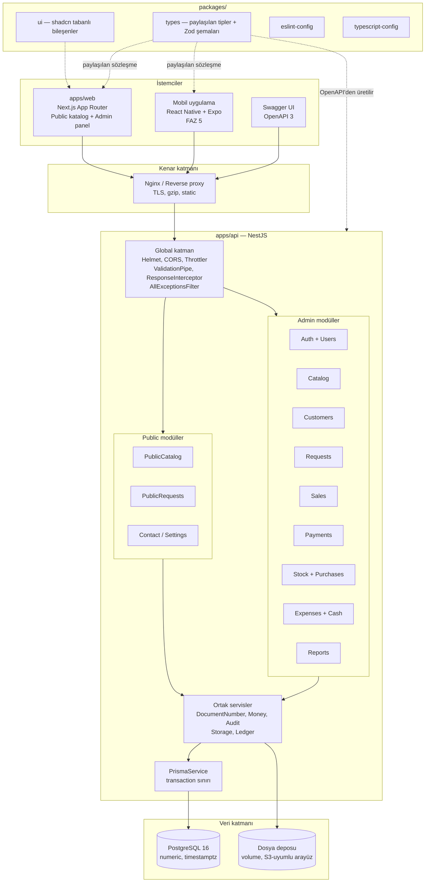
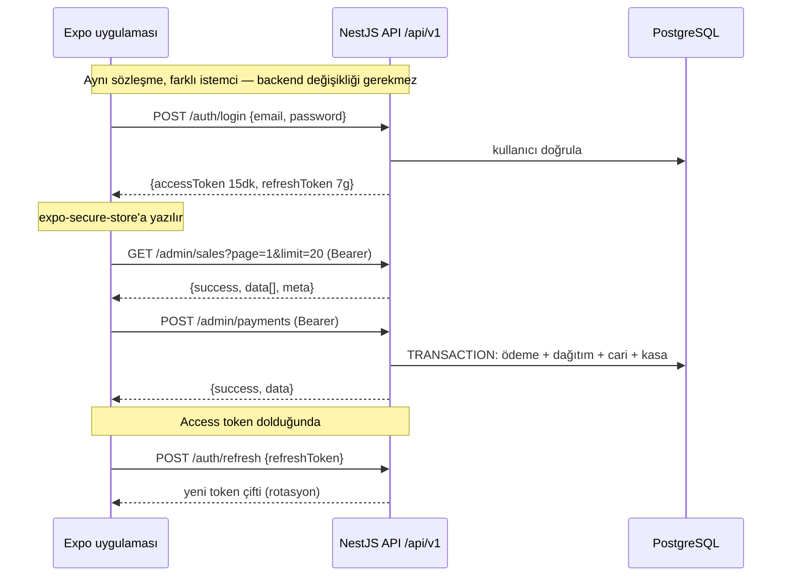
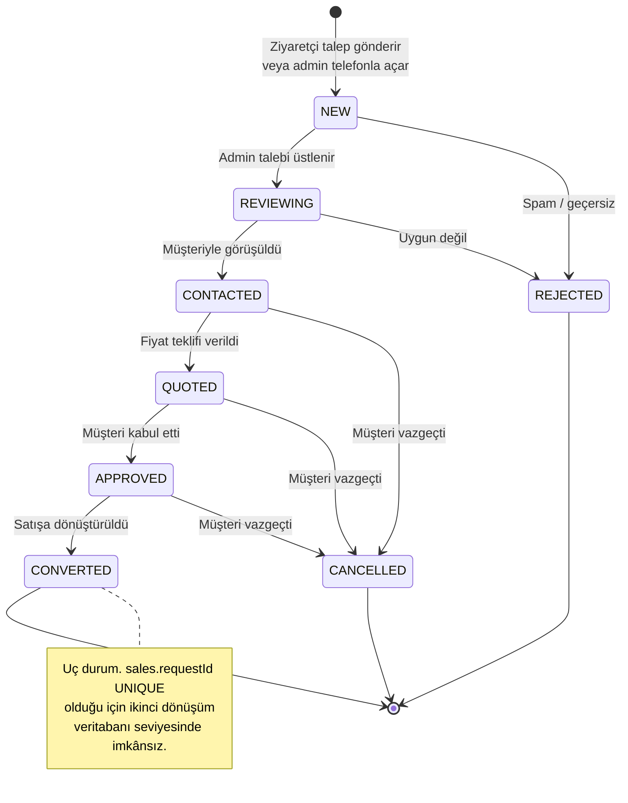
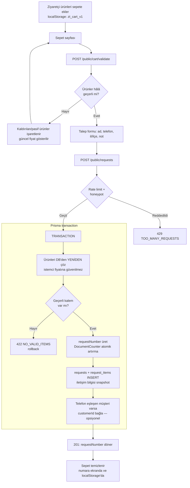
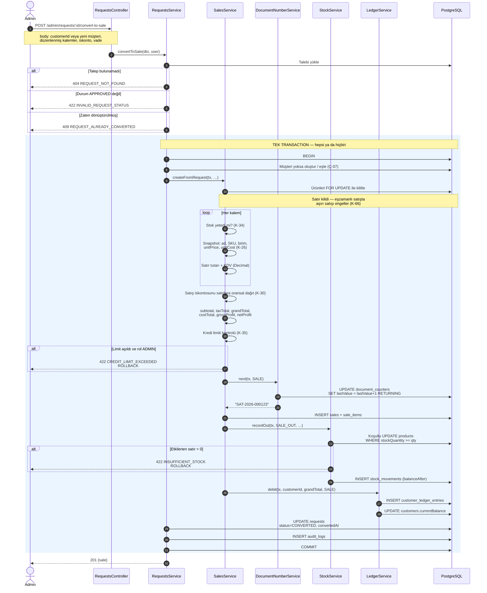
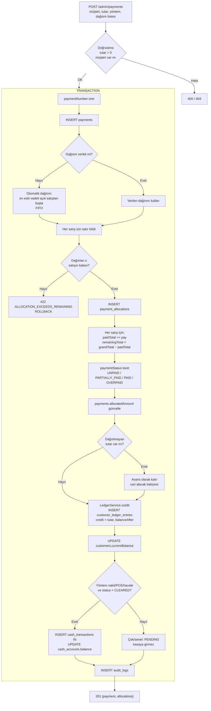
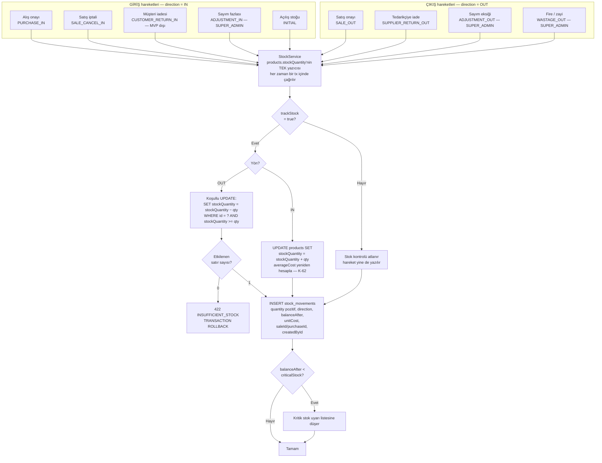
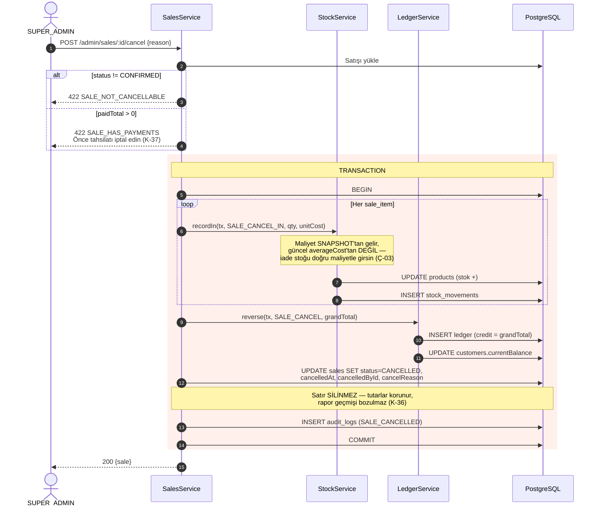

# Zirve Tarım — Mimari Doküman (Sprint 0)

|               |                                                                                                              |
| ------------- | ------------------------------------------------------------------------------------------------------------ |
| **Sürüm**     | 0.2 — şartnameyle karşılaştırıldı                                                                            |
| **Tarih**     | 2026-07-29 (ilk sürüm: 2026-07-27, Sprint 0)                                                                 |
| **Durum**     | Yürürlükte; §15 uyum denetimindeki açık maddeler karar bekliyor                                              |
| **Kapsam**    | Analiz + mimari. Sprint 0'da uygulama kodu yazılmadı; kod Sprint 1-12 arasında geldi.                        |
| **Ek çıktı**  | `docs/prisma/schema.draft.prisma` — `prisma validate` ile doğrulanmış, migration SQL üretebilen şema taslağı |
| **Şartname**  | [`docs/SPEC.md`](./SPEC.md) v1.0 — 2026-07-29'da sağlandı                                                    |
| **Uyum notu** | Bu doküman ile şartname arasındaki tüm farklar §15'te madde madde listelidir                                 |

> ### ℹ️ Bu dokümanın kaynağı ve bugünkü konumu
>
> **Sprint 0'da şartname yoktu.** Depo tek bir boş "Initial commit" içeriyordu ve mesaja ekli bir
> şartname de gelmedi. Kullanıcı onayıyla doküman, master prompt'taki domain tanımı + ziraat
> mağazası iş akışları temel alınarak **türetildi**; her önemli karar `VARSAYIM:` etiketiyle
> işaretlenip §14'te toplu listelendi (44 varsayım).
>
> **Şartname 2026-07-29'da sağlandı** ([`docs/SPEC.md`](./SPEC.md) v1.0). §14'teki 44 varsayımın
> tamamı ve §2'deki eksik/belirsizlik listesi şartnameyle karşılaştırıldı; sonuçlar ilgili
> tablolara **Şartname** sütunu olarak işlendi.
>
> #### Hangi belge hangi konuda yetkili
>
> | Konu                                     | Yetkili kaynak                                    |
> | ---------------------------------------- | ------------------------------------------------- |
> | **Ne yapılacak** (gereksinim, kapsam)    | `docs/SPEC.md` — bağlayıcı şartname               |
> | **Nasıl yapıldı** (gerçekleşen şema, uç) | `apps/api/prisma/schema.prisma` ve kodun kendisi  |
> | **Neden öyle yapıldı** (gerekçe, ADR)    | Bu doküman — özellikle §13 (ADR) ve §10 (akışlar) |
> | **Şartname ile kod arasındaki fark**     | Bu dokümanın §15'i — uyum denetimi                |
>
> **DİKKAT:** §5 (veri modeli), §6 (şema taslağı) ve §7 (endpoint planı) Sprint 0 TASARIMINI
> anlatır. Uygulama 12 sprint boyunca bazı noktalarda hem bu tasarımdan hem şartnameden ayrıştı
> (isim farkları, eklenen/eksik alanlar, enum değerleri). O bölümler **tarihsel tasarım kaydı**
> olarak korunuyor; güncel gerçek için Prisma şemasına, farkların dökümü için §15'e bakın.

---

## İçindekiler

1. [Proje özeti](#1-proje-özeti)
2. [Gereksinim analizi — eksikler ve çelişkiler](#2-gereksinim-analizi--eksikler-ve-çelişkiler)
3. [MVP kapsamı ve MVP dışı kapsam](#3-mvp-kapsamı-ve-mvp-dışı-kapsam)
4. [Sistem mimarisi](#4-sistem-mimarisi)
5. [Veri modeli ve ER diyagramı](#5-veri-modeli-ve-er-diyagramı)
6. [Prisma schema taslağı](#6-prisma-schema-taslağı)
7. [API endpoint planı](#7-api-endpoint-planı)
8. [Rol ve yetki matrisi](#8-rol-ve-yetki-matrisi)
9. [Kritik iş kuralları](#9-kritik-iş-kuralları)
10. [Akış diyagramları](#10-akış-diyagramları)
11. [Güvenlik planı ve test planı](#11-güvenlik-planı-ve-test-planı)
12. [Geliştirme fazları, riskler ve öneriler](#12-geliştirme-fazları-riskler-ve-öneriler)
13. [Karar kayıtları (ADR)](#13-karar-kayıtları-adr)
14. [Varsayım listesi](#14-varsayım-listesi)
15. [Şartname uyum denetimi](#15-şartname-uyum-denetimi)

---

## 1. Proje özeti

Zirve Tarım, tarımsal ürün satan **fiziksel bir ziraat mağazasının** dijital altyapısıdır. Sistem
iki yüzü olan tek bir üründür:

**Public web (vitrin):** Ziyaretçi ürün kataloğunu gezer, kategori/marka/etken maddeye göre filtreler,
ürün detayını ve ürünler arası uyumluluk bilgisini görür. Beğendiği ürünleri "sepete" ekler.
**Bu sepet bir sipariş değildir** — mağazaya iletilen bir **talep**tir. Online satış ve online ödeme
sistemde yoktur; ödeme ve teslimat fiziksel mağazada gerçekleşir.

**Admin panel (işletme):** Mağaza personeli gelen talepleri görür, müşteriyle telefonla iletişime
geçer, talebi **satışa dönüştürür**. Satış anında stok düşer, müşteri cari hesabı borçlanır.
Tahsilat yapıldıkça borç azalır. Sistem ayrıca tedarikçi alışları, stok hareketleri, gider ve kasa
takibi ile kâr/zarar raporlaması sağlar.

### Sistemi tanımlayan beş temel gerçek

| #   | Gerçek                        | Mimari sonucu                                                                                                                                   |
| --- | ----------------------------- | ----------------------------------------------------------------------------------------------------------------------------------------------- |
| 1   | Online ödeme yok              | Ödeme sağlayıcı entegrasyonu, PCI kapsamı, iade/chargeback akışı yok. Buna karşılık **veresiye/cari hesap** mekanizması birinci sınıf vatandaş. |
| 2   | Sepet = talep                 | Sepet bağlayıcı değil; fiyat garantisi vermez, stok rezerve etmez. Stok yalnızca satış onaylandığında düşer.                                    |
| 3   | Müşteri kaydı mağazada oluşur | Public tarafta kullanıcı hesabı yok; talep telefon numarası ile açılır. Müşteri kaydını admin oluşturur/eşler.                                  |
| 4   | Para hareketi geri alınamaz   | Finansal kayıtlar hard delete edilmez; iptal = ters kayıt + audit log.                                                                          |
| 5   | API-first                     | Backend hiçbir zaman web'e özel davranmaz; ileride React Native + Expo mobil uygulama **aynı** API'yi tüketir.                                  |

### Ziraat sektörüne özgü, ihmal edilmemesi gereken noktalar

- **Ürün uyumluluğu bir güvenlik konusudur.** Zirai ilaçların tank karışımında (tank-mix)
  birbirini nötralize eden veya bitkiye zarar veren kombinasyonlar vardır. `INCOMPATIBLE`
  ilişkisinin **tek yönlü kalması kabul edilemez** — bu, §13.2'deki veri modeli kararını doğrudan
  belirledi.
- **Ondalıklı miktar zorunlu.** Ürünler kg, litre, ton, çuval gibi birimlerde satılır; `2.5 kg`
  gerçek bir satış satırıdır. Miktar alanları `Int` değil `Decimal(18,3)`.
- **Veresiye satış normdur.** Çiftçi hasat sonrası öder. Vade takibi, kredi limiti ve cari hesap
  ekstresi opsiyonel değil, çekirdek özelliktir.
- **Mevsimsellik.** İlkbahar ve hasat dönemlerinde talep yoğunlaşır; raporların dönemsel
  karşılaştırma yapabilmesi gerekir.
- **Ruhsat ve etken madde bilgisi.** Zirai ilaçlarda bakanlık ruhsat numarası ve etken madde
  kataloğun aranabilir alanları olmalıdır.

---

## 2. Gereksinim analizi — eksikler ve çelişkiler

Bu bölüm Sprint 0'da, şartname yokken **master prompt'un kendisindeki** boşlukları ve gerilim
noktalarını işaretlemek için yazıldı. Şartname 2026-07-29'da geldi; her maddeye **Şartname**
sütunu eklendi.

Sütunun okunuşu:

- **✅ Cevaplandı** — şartname konuyu açıkça karara bağlıyor, varsayım doğrulandı.
- **⚠️ Kısmen** — şartname değiniyor ama tek yorumu zorlamıyor; varsayım geçerli sayıldı.
- **❌ Hâlâ açık** — şartname sessiz ya da kendi içinde gerilimli; karar hâlâ bekliyor.

### 2.1 Kritik eksikler (geliştirmeyi bloke eder)

| #        | Eksik                                                           | Geçici karar                                                                                                                    | Şartname                                                                                                                                                                                                                                                                                                                                                                                                                                                                                    |
| -------- | --------------------------------------------------------------- | ------------------------------------------------------------------------------------------------------------------------------- | ------------------------------------------------------------------------------------------------------------------------------------------------------------------------------------------------------------------------------------------------------------------------------------------------------------------------------------------------------------------------------------------------------------------------------------------------------------------------------------------- |
| **E-01** | `docs/SPEC.md` yok                                              | Bu doküman; §14 varsayımları                                                                                                    | **✅ Kapandı.** Şartname 2026-07-29'da sağlandı (v1.0). Tüm tablo/enum/uç/kural listeleri artık §11-§15'ten okunur; farklar §15'te.                                                                                                                                                                                                                                                                                                                                                         |
| **E-02** | Maliyet yöntemi belirsiz (FIFO / ağırlıklı ortalama / son alış) | **VARSAYIM:** Ağırlıklı ortalama maliyet (`Product.averageCost`), satır bazında snapshot                                        | **⚠️ Kısmen.** SPEC §9.2 satır bazında `unitPurchasePrice` snapshot'ı istiyor, §9.6 kârı "birim alış fiyatı" üzerinden tanımlıyor. Yani snapshot doğrulandı ama **hangi maliyetin** snapshot'landığı (ortalama mı son alış mı) söylenmiyor. Uygulama varyasyonun `purchasePrice` alanını kullanıyor — ağırlıklı ortalama DEĞİL. Varsayım bu noktada aşıldı, bkz. §15.5.                                                                                                                     |
| **E-03** | `netProfit` tanımı yok                                          | **VARSAYIM:** `netProfit = grossProfit − satışa doğrudan atanabilen giderler`. Genel işletme gideri satış düzeyinde dağıtılmaz. | **✅ Cevaplandı.** SPEC §9.6: "Net kâr: Brüt kâr − ek maliyetler" ve ek maliyetler satışa bağlı kalemler (nakliye, kargo, komisyon, işçilik). Genel gider dağıtımı istenmiyor. Varsayım doğru.                                                                                                                                                                                                                                                                                              |
| **E-04** | KDV dahil mi hariç mi                                           | **VARSAYIM:** Perakende → fiyatlar **KDV dahil**                                                                                | **✅ KAPANDI (2026-07-30).** Karar: **KDV değeri girilirse fiyat DAHİL, girilmezse HARİÇ** (oran `product_variants.taxRate`). Oran > 0 ise vergi ters hesapla ayrıştırılır (`tutar × oran / (100+oran)`), oran 0 ise kalem KDV'sizdir. `grandTotal` ETKİLENMEZ — vergi fiyatın içindedir, eklenmez. **Kâr NET tutar üzerinden hesaplanır:** ham fark kullanılsaydı %20 oranda kâr tam %20 şişerdi. Oran satış kalemine snapshot yazılır (§15.16). Ölü `sales.taxIncluded` ayarı kaldırıldı. |
| **E-05** | Talep→satış dönüşümünde fiyat bağlayıcı mı                      | **VARSAYIM:** Bağlayıcı **değil**. Satışta güncel fiyat gelir, admin manuel değiştirebilir.                                     | **✅ Cevaplandı.** SPEC §6.4 dönüşümde "satış fiyatları değiştirilebilir" ve "indirim uygulanabilir" diyor; talep fiyatı bağlayıcı sayılmıyor. Varsayım doğru.                                                                                                                                                                                                                                                                                                                              |
| **E-06** | İade süreci var mı                                              | **VARSAYIM:** MVP dışı, şema hazır                                                                                              | **✅ Cevaplandı.** SPEC §9.3 "MVP'de iade zorunlu değildir ancak mimari destekleyebilir" + §12 `SaleStatus.REFUNDED` ve `StockMovementType.RETURN`. Varsayım doğru; iki enum değeri henüz yok (§15.2).                                                                                                                                                                                                                                                                                      |

### 2.2 Belirsizlikler (varsayımla ilerlenebilir)

| #    | Belirsizlik                                            | Varsayım                                                                                | Şartname                                                                                                                                                                                                                                             |
| ---- | ------------------------------------------------------ | --------------------------------------------------------------------------------------- | ---------------------------------------------------------------------------------------------------------------------------------------------------------------------------------------------------------------------------------------------------- |
| B-01 | Public tarafta müşteri hesabı / talep takibi var mı    | Hesap yok; durum sorgusu telefon + numara ile                                           | **✅ Değişti.** SPEC notu Customer Auth'u Sprint 11 olarak kapsama aldı ve §24'teki "MVP dışı" maddelerinin önüne geçirdi. Müşteri hesabı, giriş, sepet birleştirme ve talep geçmişi uygulandı.                                                      |
| B-02 | Tek depo mu, çok depo mu                               | **Tek depo**; `Warehouse` tablosu yok                                                   | **✅ Cevaplandı.** SPEC §24 "çoklu depo" ve "çoklu mağaza" maddelerini açıkça MVP dışında bırakıyor. Varsayım doğru.                                                                                                                                 |
| B-03 | Çoklu para birimi hangi seviyede                       | Şema hazır, MVP'de yalnız `TRY`                                                         | **✅ Cevaplandı.** SPEC §2: "Para birimi ilk aşamada `TRY`", "gelecekte farklı para birimlerine uygun yapı". Varsayım doğru; uygulamada `sales.currency` var, `ExchangeRate` tablosu yok (gerekmiyor).                                               |
| B-04 | Bildirim kanalı (SMS / WhatsApp / e-posta)             | MVP dışı; talep bildirimi panel içi                                                     | **⚠️ Kısmen.** SPEC §24 SMS ve push'u MVP dışında bırakıyor ama §4.1 ana sayfada **WhatsApp bağlantısı** istiyor (bildirim değil, iletişim bağlantısı — `settings` üzerinden karşılandı). E-posta Sprint 11'de doğrulama/şifre sıfırlama için geldi. |
| B-05 | e-Fatura / e-Arşiv entegrasyonu                        | MVP dışı                                                                                | **✅ Cevaplandı.** SPEC §24 "fatura entegrasyonu" MVP dışı. Varsayım doğru.                                                                                                                                                                          |
| B-06 | Görsel depolama                                        | **VARSAYIM:** local disk + Docker volume, S3-uyumlu arayüz arkasında (`StorageService`) | **✅ Cevaplandı.** SPEC §5.2 tam olarak bunu istiyor: başlangıçta yerel, canlı için S3/R2/MinIO/Supabase'e uygun abstraction. Varsayım doğru.                                                                                                        |
| B-07 | Fiyat müşteri grubuna göre değişir mi (bayi/perakende) | MVP'de hayır; satır bazlı manuel iskonto                                                | **✅ Cevaplandı.** SPEC'te müşteri grubu / fiyat listesi hiç geçmiyor; §9.1 satır bazlı indirim tanımlıyor. Varsayım doğru.                                                                                                                          |
| B-08 | Lot / parti / SKT takibi                               | MVP dışı                                                                                | **✅ Cevaplandı.** SPEC'te lot/parti/SKT hiç geçmiyor. Varsayım doğru; risk R-07 açık kalıyor (zirai ilaçta mevzuat gerektirebilir).                                                                                                                 |

### 2.3 Çelişkiler ve gerilim noktaları

| #        | Çelişki                                                                                       | Çözüm                                                                                                                                                                                                                                                                                                                                                                                                                           |
| -------- | --------------------------------------------------------------------------------------------- | ------------------------------------------------------------------------------------------------------------------------------------------------------------------------------------------------------------------------------------------------------------------------------------------------------------------------------------------------------------------------------------------------------------------------------- |
| **Ç-01** | "Online satış YOK" ↔ sistemde sepet var                                                       | Terminoloji ayrımı zorlanır: kod ve UI'da **hiçbir yerde** `order`/`sipariş` kelimesi kullanılmaz. Varlık adı `Request`/`Talep`. Sepet UI'ı "Talep Listesi" olarak adlandırılır, "Satın Al" değil **"Talep Gönder"** butonu bulunur.                                                                                                                                                                                            |
| **Ç-02** | Kural 3 "gereken tablolarda soft delete" ↔ Kural 4 "finansal kayıtlar hard delete edilmez"    | İkisi farklı şey. **Karar:** Finansal tablolarda (`sales`, `payments`, `purchases`, `expenses`, `stock_movements`, `customer_ledger_entries`, `cash_transactions`, `payment_allocations`, `audit_logs`) **hiç `deletedAt` yok** — silme fiili olarak yasak, yalnız `CANCELLED` durumu + ters kayıt var. Soft delete yalnız katalog/tanım tablolarında (`products`, `categories`, `brands`, `customers`, `suppliers`, `users`…). |
| **Ç-03** | Kural 5 "fiyat değişimi eski kayıtları etkilemez" ↔ `Product.averageCost` sürekli değişir     | Snapshot zorunluluğu maliyeti de kapsar: `SaleItem.unitCost` satış anında dondurulur. Ürünün bugünkü maliyeti dünkü satışın kârını **değiştiremez**. Bu yüzden `grossProfit` join ile hesaplanamaz → §13.1 kararını destekler.                                                                                                                                                                                                  |
| **Ç-04** | Kural 8 "maliyet public'e sızmaz" ↔ tek `Product` modeli hem public hem admin'e servis edilir | Tek response modeli kullanılmaz. Public uçlar **açık Prisma `select`** ile ayrı `PublicProductDto` döndürür; `include` ile geniş obje dönmek yasaktır. Ayrıca CI'da otomatik "sızıntı testi" (§11.2) çalışır.                                                                                                                                                                                                                   |
| **Ç-05** | Kural 2 "float ile para hesabı yapma" ↔ JSON'da `number` tipi IEEE-754 float'tır              | Para alanları API'de **string** olarak taşınır (`"1234.5600"`). Frontend `decimal.js` ile işler. Bu bir sözleşme kararıdır → §13.6.                                                                                                                                                                                                                                                                                             |
| **Ç-06** | Kural 12 "magic number yok" ↔ KDV oranı gibi mevzuat değerleri                                | Vergi oranı sabit değil **veri**dir: ürün bazında `taxRate` kolonu + `settings` içinde varsayılan. Kodda hiçbir yerde `0.20` yazmaz.                                                                                                                                                                                                                                                                                            |
| **Ç-07** | Talep sahibi kayıtlı müşteri olmayabilir ↔ `Sale.customerId` zorunlu                          | Talep `customerId` **nullable**; iletişim bilgileri talebin üzerinde snapshot. Satışa dönüşüm sırasında müşteri **zorunlu olarak** ya eşlenir ya yeni oluşturulur. Bu dönüşüm adımının ön koşuludur.                                                                                                                                                                                                                            |

#### Şartname karşılıkları

Yedi çelişkinin altısında şartname bu dokümandaki çözümü **doğruluyor**. Biri gerilimini koruyor:

- **Ç-01 ✅ ilke doğrulandı, varlık adı değişti.** SPEC §6 sepeti "satın alma sepeti değil, ürün
  talep listesi" olarak tanımlıyor; §16 sayfa adları `/talep-sepeti` ve `/talep-basarili/...`.
  Terminoloji kararı yerinde. Ancak varlık adı `Request` değil **`Inquiry`**: SPEC §11
  `inquiries` / `inquiry_items` / `inquiry_status_histories` tablolarını, §12 `InquiryStatus`
  enum'unu adlandırıyor ve uygulama bunu izliyor. §5-§7'deki `Request*` adları tarihseldir.
- **Ç-02 ❌ gerilim korunuyor — şartname iki yönlü.** SPEC §15.21 "finansal kayıtlar hard delete
  edilmemelidir" derken §11 `sales` ve `payments` tablolarına **`deletedAt` kolonu** koyuyor. Bu
  doküman finansal tablolarda `deletedAt` bulunmaması yönünde karar verdi ve uygulama o kararı
  izledi: iptal `CANCELLED` durumu + ters stok hareketiyle yapılıyor. Karar korunuyor çünkü
  soft delete, "silinmiş görünen ama ödemesi duran satış" gibi tutarsız durumlara kapı açar.
  Farkın kaydı §15.3'te; şartnameyle uyuşmayan bilinçli sapma olarak izlenmeli.
- **Ç-03 ✅** SPEC §9.2 ve §15.16 satır bazlı fiyat snapshot'ını açıkça şart koşuyor.
- **Ç-04 ✅** SPEC §18 "public endpointlerde hassas finans alanları dönmemeli" — sızıntı testi
  (§11.2) bu şartın otomatik karşılığı.
- **Ç-05 ✅** SPEC §2 ve §22 float yasağını ve `Decimal` zorunluluğunu tekrarlıyor. String taşıma
  kararı bu şartın JSON düzeyindeki karşılığı.
- **Ç-06 ✅** SPEC §22 "magic number kullanılmamalı" + §11 `unit_types`/`settings` tabloları.
- **Ç-07 ✅** SPEC §11 `inquiries.customerId (nullable)`, §6.4 dönüşümde müşteri seçme/oluşturma
  adımını zorunlu kılıyor. Karar birebir örtüşüyor.

---

## 3. MVP kapsamı ve MVP dışı kapsam

### 3.1 MVP — içeride

**Public web**

- Ana sayfa, kategori ağacı, marka listesi
- Ürün listeleme: sayfalama, arama, kategori/marka/fiyat/stokta-var filtresi, sıralama
- Ürün detayı: görseller, açıklama, nitelikler, etken madde, ruhsat no
- İlgili ürünler: benzer / uyumlu / **uyumsuz uyarısı**
- Talep sepeti (localStorage) + talep gönderme formu
- Talep durumu sorgulama (numara + telefon)
- İletişim formu, mağaza bilgileri, SEO (meta, sitemap, JSON-LD)

**Admin panel**

- JWT ile giriş, refresh token rotasyonu, rol bazlı erişim
- Kategori / marka / ürün CRUD + görsel yükleme + ürün ilişkileri
- Müşteri CRUD + cari hesap ekstresi
- Talep yönetimi: liste, detay, durum değiştirme, atama, not
- **Talep → satış dönüşümü**
- Satış: oluşturma, satır bazlı iskonto, onaylama, iptal
- Stok: hareket defteri, manuel düzeltme, kritik stok uyarısı
- Tedarikçi + alış faturası (stok girişi, ortalama maliyet güncelleme)
- Ödeme/tahsilat: kısmi ödeme, çoklu satışa dağıtım, borç takibi
- Gider ve kasa hareketleri
- Dashboard + temel raporlar: satış, kâr, borç yaşlandırma, stok değeri, en çok satan
- Ayarlar, kullanıcı yönetimi, audit log görüntüleme

**Altyapı**

- Turborepo + pnpm monorepo, Docker Compose ile tek komut ayağa kalkma
- Standart response formatı, global exception filter, response interceptor
- Swagger/OpenAPI dokümantasyonu
- Prisma migration + seed
- Unit / integration / e2e test altyapısı

### 3.2 MVP dışı — sonraya

| Özellik                            | Neden ertelendi                                       | Şema hazır mı                 |
| ---------------------------------- | ----------------------------------------------------- | ----------------------------- |
| Online ödeme                       | Ürün tanımı gereği kapsam dışı                        | —                             |
| React Native + Expo mobil          | API-first tasarım bunu zaten mümkün kılıyor; ayrı faz | Evet                          |
| İade / iptal-iade akışı            | Cari + stok + kâr üçlü etkisi, ayrı tasarım gerekir   | Evet (enum'lar mevcut)        |
| e-Fatura / e-Arşiv                 | Entegratör seçimi ve mali müşavir onayı gerekir       | Kısmen                        |
| SMS / WhatsApp bildirim            | Sağlayıcı seçimi + maliyet onayı                      | Hayır                         |
| Çoklu depo                         | Tek mağaza için gereksiz karmaşıklık                  | Hayır (migration ile eklenir) |
| Lot / SKT takibi                   | Zirai ilaçta gerekebilir, mevzuat netleşmeli          | Hayır                         |
| Müşteri grubu / bayi fiyatı        | Manuel iskonto MVP'de yeterli                         | Hayır                         |
| Çoklu para birimi (aktif kullanım) | Şema hazır, iş akışı ve kur beslemesi yok             | Evet                          |
| Gelişmiş BI / tahminleme           | Veri birikmeden anlamsız                              | —                             |

### 3.3 Şartname karşısında kapsam düzeltmesi

> **Bu bölüm 2026-07-29'da eklendi.** §3.1 Sprint 0'da, şartname yokken yazıldı ve ziraat
> mağazası iş akışlarından türetildiği için **şartnamenin istemediği alanlara taştı**. Şartname
> geldiğinde o fazlalıklar kapsamdan düştü; uygulama da onları hiç yazmadı.

**§3.1'de duran ama ŞARTNAMEDE OLMAYAN ve UYGULANMAYAN kalemler** — §3.1 listesi okunurken bu
maddeler yok sayılmalıdır:

| §3.1'deki kalem                       | Durum                                                                                                                                                                                                             |
| ------------------------------------- | ----------------------------------------------------------------------------------------------------------------------------------------------------------------------------------------------------------------- |
| Tedarikçi + alış faturası             | **Kapsam dışı.** Şartnamede tedarikçi/alış modülü yok. `Supplier`, `Purchase` tabloları yazılmadı. Stok girişi `MANUAL_IN` / `PURCHASE` hareketiyle yapılıyor.                                                    |
| Gider ve kasa hareketleri             | **Kapsam dışı.** Şartnamede gider/kasa modülü yok. `Expense`, `CashTransaction` tabloları yazılmadı. Satışa bağlı maliyetler `sale_additional_costs` ile karşılandı.                                              |
| Cari hesap ekstresi (ledger)          | **Farklı çözüldü.** `customer_ledger_entries` tablosu yazılmadı. SPEC §8 borcun "manuel alan olarak tutulmaması"nı, satış ve ödemeler üzerinden hesaplanmasını istiyor; finans özeti bu iki tablodan türetiliyor. |
| Talep durumu sorgulama (no+telefon)   | **Yerini müşteri hesabı aldı.** Sprint 11'de müşteri girişi geldi; talep geçmişi hesap üzerinden görülüyor (B-01).                                                                                                |
| Borç yaşlandırma / stok değeri raporu | **Daraltıldı.** SPEC §14 finans uçları: dashboard, receivables, overdue, profit-report, sales-report, payment-report. Yaşlandırma dilimleri (V-25) uygulanmadı.                                                   |

**Şartnamede olup §3.1'de eksik kalan kalemler** (sonradan kapsama alındı):

| Şartname maddesi                                        | Karşılığı                                                                     |
| ------------------------------------------------------- | ----------------------------------------------------------------------------- |
| §4.4/§4.5 bitki ve toprak türü yönetimi                 | `plants`, `soil_types` + ürün ilişkileri — Sprint 3'te geldi                  |
| §5.5/§5.6 yarar ve yan etki katalogları                 | `benefits`, `side_effects` + ürün ilişkileri, `severityOverride` — Sprint 3-4 |
| §11 `usage_periods` kullanım dönemleri                  | Ayrı taksonomi tablosu — Sprint 3                                             |
| §5.4 birim türleri ayrı tabloda, `allowsDecimal` kuralı | `unit_types`; "adet biriminde ondalık yasak" kuralının veri kaynağı           |
| Müşteri hesabı (SPEC notu, Sprint 11)                   | `customer_accounts`, `carts`, e-posta doğrulama ve şifre sıfırlama jetonları  |

### 3.4 MVP'nin "bitti" tanımı

1. Boş bir makinede `docker compose up` ile tüm sistem ayağa kalkar, seed veri yüklenir.
2. Ziyaretçi katalogdan talep gönderebilir; admin bu talebi satışa çevirebilir; stok düşer;
   kısmi tahsilat girilir; müşteri borcu doğru görünür; kâr raporu tutar.
3. Public API yanıtlarının hiçbirinde alış fiyatı / maliyet / kâr alanı yoktur (otomatik test).
4. Tüm `/admin/*` uçları yetkisiz erişimi reddeder (otomatik test).
5. Satış/ödeme/stok işlemleri transaction'dır; hata durumunda kısmi yazma oluşmaz (test).
6. Kritik iş kuralları (§9) için testler yeşildir.

---

## 4. Sistem mimarisi

### 4.1 Bileşen diyagramı



### 4.2 Monorepo yerleşimi

```
zirve-tarim/
├── apps/
│   ├── api/                     NestJS + Prisma
│   │   ├── prisma/
│   │   │   ├── schema.prisma
│   │   │   ├── migrations/
│   │   │   └── seed.ts
│   │   ├── src/
│   │   │   ├── common/          filters, interceptors, decorators, pipes, dto
│   │   │   ├── config/          env doğrulama (Zod), yapılandırma
│   │   │   ├── infra/           PrismaService, StorageService, LoggerService
│   │   │   ├── modules/
│   │   │   │   ├── auth/  users/  categories/  brands/  products/
│   │   │   │   ├── customers/  requests/  sales/  payments/
│   │   │   │   ├── suppliers/  purchases/  stock/
│   │   │   │   ├── expenses/  cash/  reports/  settings/  audit/
│   │   │   │   └── public/      public-facing controller'lar
│   │   │   └── shared/          DocumentNumberService, MoneyService, LedgerService
│   │   └── test/                e2e
│   └── web/                     Next.js App Router
│       └── src/app/
│           ├── (public)/        katalog, ürün, sepet, talep, iletişim
│           └── admin/           panel
├── packages/
│   ├── ui/  types/  eslint-config/  typescript-config/
├── docs/
│   ├── ARCHITECTURE.md
│   └── prisma/schema.draft.prisma
├── docker-compose.yml
├── turbo.json
└── pnpm-workspace.yaml
```

### 4.3 API-first yaklaşımı — pratikte ne demek

Bu proje "önce web'i yapıp sonra mobil için API açmak" değil, **tek bir sözleşmeye birden çok
istemcinin bağlanması** olarak kurgulanır. Somut kurallar:

1. **Backend istemci bilmez.** `apps/api` içinde `web`, `next`, `browser` gibi bir kavram yoktur.
   Server Action veya Next.js'e özel bir uç bulunmaz.
2. **Tüm iş kuralları backend'de zorunlu tutulur.** Frontend validasyonu yalnızca UX içindir;
   `curl` ile aynı isteği atan biri aynı hatayı almalıdır. Bu, §9'daki her kuralın _Zorlama katmanı_
   sütununda "servis" veya "DB" yazmasının sebebidir.
3. **Sözleşme tek yerden üretilir.** NestJS Swagger dekoratörlerinden OpenAPI şeması üretilir;
   `packages/types` bu şemadan istemci tipleri türetir. Web ve mobil aynı tipleri kullanır.
4. **Kimlik doğrulama taşınabilirdir.** Oturum cookie'ye bağlı değildir: `Authorization: Bearer`
   ile access token, ayrı bir uçtan refresh. Mobil uygulama token'ı güvenli depoda tutar.
   _VARSAYIM:_ Web'de refresh token `httpOnly` cookie'de, access token bellekte tutulur (XSS azaltma);
   mobilde ikisi de `expo-secure-store`'da. Backend her iki taşıma biçimini de kabul eder.
5. **Sürümleme.** Tüm uçlar `/api/v1/...` altındadır. Kırıcı değişiklik `v2` açar; mobil
   uygulamanın mağaza onayı gecikeceği için eski sürüm bir süre yaşamaya devam eder.
6. **Sayfalama, arama, filtre, sıralama** tüm liste uçlarında **aynı** query sözleşmesiyle çalışır
   (§7.1) — istemci başına özel parametre yoktur.

### 4.4 Mobil uygulama ileride nasıl bağlanır



Mobil için gereken **tek** ek iş: `packages/types` paketinin React Native tarafında da tüketilebilmesi
(saf TypeScript olduğu için sorunsuz) ve dosya yükleme uçlarının `multipart/form-data` kabul etmesi
(zaten öyle). Backend'de mobil-özel kod yazılmaz.

### 4.5 Katman sorumlulukları

| Katman               | Sorumluluk                                                  | Yasak                                        |
| -------------------- | ----------------------------------------------------------- | -------------------------------------------- |
| Controller           | Yönlendirme, DTO bağlama, Swagger, guard                    | İş kuralı, Prisma çağrısı, hesaplama         |
| DTO + ValidationPipe | Şekil ve tip doğrulama, `whitelist`, `forbidNonWhitelisted` | İş kuralı doğrulaması                        |
| Guard / Decorator    | JWT doğrulama, rol kontrolü, kullanıcı bağlamı              | Veri okuma dışında iş mantığı                |
| **Service**          | **Tüm iş kuralları, transaction sınırı, hesaplama**         | HTTP kavramı (`Request`, `Response` nesnesi) |
| Shared service       | Belge numarası, para aritmetiği, cari defter, audit         | Modüle özel kural                            |
| PrismaService        | Bağlantı, transaction yardımcıları, soft-delete filtresi    | İş kuralı                                    |
| DB (constraint)      | Son savunma hattı: unique, check, FK                        | —                                            |

**Transaction sınırı yalnızca service katmanındadır.** Controller `prisma.$transaction` çağırmaz;
bir service başka bir service'i transaction içinde çağıracaksa `tx` client'ı parametre olarak
geçirilir (`(tx: Prisma.TransactionClient, ...)` imzası).

---

## 5. Veri modeli ve ER diyagramı

> **⚠️ TARİHSEL TASARIM.** Bu bölüm Sprint 0'da, şartname yokken türetildi ve 31 tablo öneriyor.
> Uygulanan şema **39 model** içeriyor ve tablo kümesi farklı: tedarikçi/alış/gider/kasa/cari
> tabloları hiç yazılmadı, müşteri hesabı ve sepet tabloları sonradan eklendi. Ayrıca varlık
> adlandırması değişti (`Request` → **`Inquiry`**).
>
> Güncel gerçek: [`apps/api/prisma/schema.prisma`](../apps/api/prisma/schema.prisma).
> Şartname ile aradaki farkların dökümü: **§15.3 ve §15.4**.
>
> Bölüm silinmiyor çünkü ilişki kardinaliteleri, snapshot gerekçeleri ve indeks seçimleri hâlâ
> geçerli tasarım kaydıdır.

### 5.1 Alan grupları

| Grup         | Tablolar                                                                                                                 | Not                               |
| ------------ | ------------------------------------------------------------------------------------------------------------------------ | --------------------------------- |
| Kimlik       | `users`, `refresh_tokens`, `audit_logs`                                                                                  | `audit_logs` yalnız INSERT        |
| Katalog      | `categories`, `brands`, `products`, `product_images`, `product_attributes`, `product_relations`, `product_price_history` | Soft delete var                   |
| Müşteri      | `customers`, `customer_addresses`, `customer_ledger_entries`                                                             | Ledger finansal → soft delete yok |
| Talep        | `requests`, `request_items`                                                                                              | Snapshot iletişim bilgisi         |
| Satış        | `sales`, `sale_items`                                                                                                    | Snapshot ürün + maliyet           |
| Tahsilat     | `payments`, `payment_allocations`                                                                                        | Bir ödeme ↔ çok satış             |
| Tedarik/Stok | `suppliers`, `purchases`, `purchase_items`, `stock_movements`                                                            | `stock_movements` değişmez defter |
| Finans       | `cash_accounts`, `cash_transactions`, `expense_categories`, `expenses`                                                   |                                   |
| Sistem       | `settings`, `document_counters`, `exchange_rates`, `contact_messages`                                                    |                                   |

**Toplam 31 tablo, 24 enum.** Doğrulama: `prisma validate` başarılı; `prisma migrate diff` ile
1083 satırlık, 31 `CREATE TABLE` + 24 `CREATE TYPE` + 45 FK içeren migration SQL üretiliyor.

### 5.2 İlişkilerin özeti

- **Kategori ağacı** kendine referanslıdır (`parentId`), silme `Restrict` — altında ürün veya alt
  kategori varken silinemez.
- **Ürün ilişkileri** simetriktir ve **tek satırda** saklanır (`productAId < productBId` kanonik
  sıralama). Gerekçe §13.2.
- **Talep → satış** ilişkisi **bire-bir**dir: `sales.requestId` UNIQUE. Bir talep iki kez satışa
  dönüştürülemez; bu kısıt veritabanı seviyesinde garanti altındadır.
- **Ödeme → satış** ilişkisi **çoka-çok**tur, `payment_allocations` ara tablosuyla. Tek tahsilat
  birden fazla açık satışa dağıtılabilir; bir satış birden fazla taksitle kapanabilir. Dağıtılmayan
  tutar (`amount − allocatedAmount`) müşteri avansıdır.
- **Cari defter** (`customer_ledger_entries`) borç/alacağın tek doğruluk kaynağıdır;
  `customers.currentBalance` bu defterin türevidir ve mutabakatla doğrulanır.
- **Stok defteri** (`stock_movements`) aynı şekilde stoğun tek doğruluk kaynağıdır;
  `products.stockQuantity` türevdir. Her hareket `balanceAfter` taşır.
- **Kasa** (`cash_transactions`) ödeme veya giderle **bire-bir** bağlanır (`paymentId`/`expenseId`
  UNIQUE nullable) — aynı tahsilat kasaya iki kez giremez.
- **Snapshot satırları** (`request_items`, `sale_items`, `purchase_items`) ürüne `SetNull` ile
  bağlıdır: ürün soft-delete edilse bile satır adı/SKU'yu kendi içinde taşıdığı için geçmiş kayıt
  okunabilir kalır.
- **Finansal tablolarda silme `Restrict`**: ödemesi olan müşteri, hareketi olan ürün silinemez.

### 5.3 ER diyagramı

```mermaid
erDiagram
    users ||--o{ refresh_tokens : "oturum"
    users ||--o{ audit_logs : "eylem"
    users ||--o{ requests : "atanan"
    users ||--o{ sales : "oluşturan"
    users ||--o{ payments : "kaydeden"
    users ||--o{ purchases : "kaydeden"
    users ||--o{ stock_movements : "kaydeden"
    users ||--o{ expenses : "kaydeden"
    users ||--o{ cash_transactions : "kaydeden"
    users ||--o{ product_price_history : "değiştiren"
    users ||--o{ customer_ledger_entries : "kaydeden"
    users ||--o{ contact_messages : "ilgilenen"

    categories ||--o{ categories : "üst kategori"
    categories ||--o{ products : "içerir"
    brands ||--o{ products : "markası"
    products ||--o{ product_images : "görselleri"
    products ||--o{ product_attributes : "nitelikleri"
    products ||--o{ product_price_history : "fiyat geçmişi"
    products ||--o{ product_relations : "A tarafı"
    products ||--o{ product_relations : "B tarafı"
    products ||--o{ stock_movements : "hareketleri"
    products ||--o{ request_items : "snapshot"
    products ||--o{ sale_items : "snapshot"
    products ||--o{ purchase_items : "snapshot"

    customers ||--o{ customer_addresses : "adresleri"
    customers ||--o{ requests : "talepleri"
    customers ||--o{ sales : "satışları"
    customers ||--o{ payments : "ödemeleri"
    customers ||--o{ customer_ledger_entries : "cari hesabı"

    requests ||--o{ request_items : "kalemleri"
    requests ||--o| sales : "dönüşüm 1-1"

    sales ||--o{ sale_items : "kalemleri"
    sales ||--o{ payment_allocations : "tahsilat dağıtımı"
    sales ||--o{ stock_movements : "stok çıkışı"
    sales ||--o{ customer_ledger_entries : "borç kaydı"

    payments ||--o{ payment_allocations : "dağıtım"
    payments ||--o{ customer_ledger_entries : "alacak kaydı"
    payments ||--o| cash_transactions : "kasa girişi"

    suppliers ||--o{ purchases : "alışları"
    purchases ||--o{ purchase_items : "kalemleri"
    purchases ||--o{ stock_movements : "stok girişi"

    cash_accounts ||--o{ cash_transactions : "hareketleri"
    expense_categories ||--o{ expenses : "giderleri"
    expenses ||--o| cash_transactions : "kasa çıkışı"

    users {
        uuid id PK
        varchar email UK
        varchar passwordHash
        enum role "SUPER_ADMIN|ADMIN"
        enum status
        timestamptz deletedAt
    }
    refresh_tokens {
        uuid id PK
        uuid userId FK
        varchar tokenHash UK
        timestamptz expiresAt
        timestamptz revokedAt
    }
    audit_logs {
        uuid id PK
        uuid userId FK
        enum action
        varchar entityType
        uuid entityId
        json beforeData
        json afterData
    }
    categories {
        uuid id PK
        uuid parentId FK
        varchar slug UK
        varchar name
        bool isActive
        timestamptz deletedAt
    }
    brands {
        uuid id PK
        varchar slug UK
        varchar name
        timestamptz deletedAt
    }
    products {
        uuid id PK
        varchar sku UK
        varchar slug UK
        uuid categoryId FK
        uuid brandId FK
        enum unit
        numeric purchasePrice "HASSAS"
        numeric salePrice
        numeric taxRate
        numeric stockQuantity "türev"
        numeric averageCost "HASSAS"
        varchar activeIngredient
        timestamptz deletedAt
    }
    product_images {
        uuid id PK
        uuid productId FK
        varchar url
        bool isPrimary
    }
    product_attributes {
        uuid id PK
        uuid productId FK
        varchar name
        varchar value
    }
    product_relations {
        uuid id PK
        uuid productAId FK "A < B kanonik"
        uuid productBId FK
        enum type "COMPATIBLE|INCOMPATIBLE|SIMILAR"
        varchar note
    }
    product_price_history {
        uuid id PK
        uuid productId FK
        numeric oldSalePrice
        numeric newSalePrice
    }
    customers {
        uuid id PK
        varchar code UK
        enum type
        varchar fullName
        varchar phone
        numeric creditLimit
        numeric currentBalance "türev"
        timestamptz deletedAt
    }
    customer_addresses {
        uuid id PK
        uuid customerId FK
        varchar city
        text fullAddress
    }
    customer_ledger_entries {
        uuid id PK
        uuid customerId FK
        enum entryType
        uuid saleId FK
        uuid paymentId FK
        numeric debit
        numeric credit
        numeric balanceAfter
    }
    requests {
        uuid id PK
        varchar requestNumber UK
        uuid customerId FK
        enum status
        enum source
        varchar contactName
        varchar contactPhone
        numeric estimatedTotal
        timestamptz deletedAt
    }
    request_items {
        uuid id PK
        uuid requestId FK
        uuid productId FK
        varchar productName "snapshot"
        numeric quantity
        numeric unitPrice
    }
    sales {
        uuid id PK
        varchar saleNumber UK
        uuid customerId FK
        uuid requestId FK,UK
        enum status
        enum paymentStatus
        numeric grandTotal
        numeric paidTotal "stored"
        numeric remainingTotal "stored"
        numeric grossProfit "HASSAS-stored"
        numeric netProfit "HASSAS-stored"
    }
    sale_items {
        uuid id PK
        uuid saleId FK
        uuid productId FK
        varchar productName "snapshot"
        numeric quantity
        numeric unitPrice "snapshot"
        numeric unitCost "HASSAS-snapshot"
        numeric lineTotal
    }
    payments {
        uuid id PK
        varchar paymentNumber UK
        uuid customerId FK
        enum method
        enum status
        numeric amount
        numeric allocatedAmount
        timestamptz dueDate
    }
    payment_allocations {
        uuid id PK
        uuid paymentId FK
        uuid saleId FK
        numeric amount
    }
    suppliers {
        uuid id PK
        varchar code UK
        varchar name
        timestamptz deletedAt
    }
    purchases {
        uuid id PK
        varchar purchaseNumber UK
        uuid supplierId FK
        enum status
        numeric grandTotal
    }
    purchase_items {
        uuid id PK
        uuid purchaseId FK
        uuid productId FK
        numeric quantity
        numeric unitCost
    }
    stock_movements {
        uuid id PK
        uuid productId FK
        enum type
        enum direction "IN|OUT"
        numeric quantity "her zaman pozitif"
        numeric balanceAfter
        numeric unitCost "HASSAS"
        uuid saleId FK
        uuid purchaseId FK
    }
    cash_accounts {
        uuid id PK
        enum type
        numeric balance "türev"
    }
    cash_transactions {
        uuid id PK
        uuid cashAccountId FK
        enum direction
        numeric amount
        uuid paymentId FK,UK
        uuid expenseId FK,UK
    }
    expense_categories {
        uuid id PK
        varchar name UK
    }
    expenses {
        uuid id PK
        varchar expenseNumber UK
        uuid categoryId FK
        numeric amount
        enum status
    }
    settings {
        uuid id PK
        varchar key UK
        text value
        bool isPublic
    }
    document_counters {
        uuid id PK
        enum docType
        int period
        int lastValue
    }
    exchange_rates {
        uuid id PK
        enum currency
        numeric rate
        date rateDate
    }
    contact_messages {
        uuid id PK
        varchar fullName
        enum status
        timestamptz deletedAt
    }
```



---

## 6. Prisma schema taslağı

> **⚠️ TASLAK — yürürlükteki şema değil.** `docs/prisma/schema.draft.prisma` Sprint 0 taslağıdır ve
> o günden beri güncellenmedi. Yürürlükteki şema
> [`apps/api/prisma/schema.prisma`](../apps/api/prisma/schema.prisma) ve `apps/api/prisma/migrations/`
> altındaki migration'lardır. Taslakla aradaki farklar §15.3-§15.4'te.

Tam ve **derlenebilir** şema: **[`docs/prisma/schema.draft.prisma`](./prisma/schema.draft.prisma)**

Şema tek kaynak olarak ayrı dosyada tutulur — bu dokümana kopyalanması sürüm kayması (drift)
riski yaratacağı için içerik burada tekrarlanmaz; bu bölüm şemanın **tasarım kararlarını** açıklar.
Sprint 1'de dosya `apps/api/prisma/schema.prisma` konumuna taşınıp ilk migration üretilecektir.

### 6.1 Doğrulama sonucu

```bash
$ npx prisma validate --schema ./schema.prisma
Prisma schema loaded from schema.prisma
The schema at schema.prisma is valid 🚀

$ npx prisma migrate diff --from-empty --to-schema-datamodel ./schema.prisma --script
# 1083 satır SQL — 31 CREATE TABLE, 24 CREATE TYPE, 45 FOREIGN KEY
```

### 6.2 Konvansiyonlar

| Konu                 | Karar                                                                                                |
| -------------------- | ---------------------------------------------------------------------------------------------------- |
| Birincil anahtar     | `String @id @default(uuid()) @db.Uuid`                                                               |
| Zaman damgası        | `@db.Timestamptz(6)`, tümü UTC. `createdAt`/`updatedAt` her tabloda                                  |
| Soft delete          | `deletedAt` yalnız katalog/tanım tablolarında (bkz. Ç-02)                                            |
| Tablo adı            | `@@map` ile `snake_case` çoğul                                                                       |
| Tutar                | `Decimal(18,4)` → `numeric(18,4)`                                                                    |
| Miktar               | `Decimal(18,3)` → ondalıklı kg/litre                                                                 |
| Oran (KDV/iskonto %) | `Decimal(6,3)` — `20.000` = %20                                                                      |
| Kur                  | `Decimal(18,8)`                                                                                      |
| Silme davranışı      | Finansal referanslarda `Restrict`; snapshot satırlarında `SetNull`; sahiplik ilişkilerinde `Cascade` |
| Enum                 | 24 adet; kodda hiçbir yerde serbest string durum değeri yok (Kural 12)                               |

### 6.3 Enum envanteri

`UserRole` · `UserStatus` · `CurrencyCode` · `CustomerType` · `ProductUnit` · `ProductRelationType` ·
`DiscountType` · `RequestSource` · `RequestStatus` · `SaleStatus` · `SalePaymentStatus` ·
`PaymentDirection` · `PaymentMethod` · `PaymentStatus` · `StockMovementType` ·
`StockMovementDirection` · `PurchaseStatus` · `ExpenseStatus` · `CashAccountType` ·
`CashTransactionDirection` · `LedgerEntryType` · `AuditAction` · `ContactMessageStatus` ·
`DocumentType`

### 6.4 Prisma'nın ifade edemediği kısıtlar — migration'a elle eklenecek SQL

Prisma DSL `CHECK` constraint ve kısmi index desteklemez. İlk migration dosyasına **elle** eklenmesi
gereken ifadeler:

```sql
-- Kanonik ürün ilişkisi: aynı çift iki kez, ters yönde yazılamaz (§13.2)
ALTER TABLE product_relations
  ADD CONSTRAINT chk_product_relation_canonical CHECK ("productAId" < "productBId");
ALTER TABLE product_relations
  ADD CONSTRAINT chk_product_relation_not_self  CHECK ("productAId" <> "productBId");

-- Negatif stok yasak — son savunma hattı (§13.4)
ALTER TABLE products
  ADD CONSTRAINT chk_products_stock_non_negative CHECK ("stockQuantity" >= 0);
ALTER TABLE stock_movements
  ADD CONSTRAINT chk_stock_movement_qty_positive CHECK (quantity > 0);
ALTER TABLE stock_movements
  ADD CONSTRAINT chk_stock_movement_balance_non_negative CHECK ("balanceAfter" >= 0);

-- Para tutarlılığı
ALTER TABLE sales
  ADD CONSTRAINT chk_sales_totals_non_negative
  CHECK ("grandTotal" >= 0 AND "paidTotal" >= 0 AND subtotal >= 0);
ALTER TABLE sales
  ADD CONSTRAINT chk_sales_remaining_identity
  CHECK ("remainingTotal" = "grandTotal" - "paidTotal");
ALTER TABLE payments
  ADD CONSTRAINT chk_payments_amount_positive CHECK (amount > 0);
ALTER TABLE payments
  ADD CONSTRAINT chk_payments_allocated_within_amount
  CHECK ("allocatedAmount" >= 0 AND "allocatedAmount" <= amount);
ALTER TABLE payment_allocations
  ADD CONSTRAINT chk_allocation_amount_positive CHECK (amount > 0);

-- Cari defter: bir satır ya borç ya alacak, ikisi birden değil
ALTER TABLE customer_ledger_entries
  ADD CONSTRAINT chk_ledger_single_side
  CHECK ((debit > 0 AND credit = 0) OR (credit > 0 AND debit = 0));

-- Kasa hareketi tek bir kaynağa bağlanır
ALTER TABLE cash_transactions
  ADD CONSTRAINT chk_cash_tx_single_source
  CHECK (num_nonnulls("paymentId", "expenseId") <= 1);

-- Soft delete ile birlikte çalışan kısmi benzersizlik:
-- silinmiş kaydın slug/SKU'su yeniden kullanılabilsin
DROP INDEX IF EXISTS "products_sku_key";
DROP INDEX IF EXISTS "products_slug_key";
CREATE UNIQUE INDEX products_sku_active_key  ON products (sku)  WHERE "deletedAt" IS NULL;
CREATE UNIQUE INDEX products_slug_active_key ON products (slug) WHERE "deletedAt" IS NULL;
-- categories.slug, brands.slug, customers.code, suppliers.code için de aynısı

-- Tam metin arama (ürün adı + SKU + etken madde)
CREATE INDEX products_search_idx ON products
  USING GIN (to_tsvector('simple', name || ' ' || sku || ' ' || COALESCE("activeIngredient", '')));

-- Audit log değişmezliği (§11.1)
CREATE RULE audit_logs_no_update AS ON UPDATE TO audit_logs DO INSTEAD NOTHING;
CREATE RULE audit_logs_no_delete AS ON DELETE TO audit_logs DO INSTEAD NOTHING;
```

> **VARSAYIM:** Türkçe arama için `to_tsvector('simple', …)` yeterli kabul edildi; PostgreSQL'in
> yerleşik Türkçe sözlüğü yoktur. Aksan/ekleme duyarlılığı sorun olursa `unaccent` uzantısı
>
> - trigram (`pg_trgm`) indeksine geçilir.

### 6.5 Seed içeriği (Sprint 1)

1 `SUPER_ADMIN` + 1 `ADMIN` kullanıcı · örnek kategori ağacı (Zirai İlaç → Herbisit/İnsektisit/Fungisit,
Gübre, Tohum, Sulama, Ekipman) · 5-6 marka · ~40 ürün (ondalıklı birimler ve `INCOMPATIBLE` ilişki
örnekleri dahil) · 10 müşteri (biri kredi limiti aşımı senaryosu için borçlu) · 3 tedarikçi ·
1 varsayılan kasa · gider kategorileri · varsayılan `settings` · `document_counters` başlangıç satırları.

---

## 7. API endpoint planı

> **⚠️ TARİHSEL PLAN.** Şartname §14 kendi uç listesini veriyor ve uygulama büyük ölçüde onu
> izliyor. En görünür fark: public uçlar **`/public` öneki altında** (`GET /public/products`),
> şartnamede önek yok. Tam karşılaştırma: **§15.6**.
>
> Güncel gerçek: Swagger (`http://localhost:4000/docs`) ve `apps/api/src/modules/*/**.controller.ts`.

### 7.1 Ortak sözleşme

**Taban yol:** `/api/v1`

**Başarılı yanıt**

```json
{ "success": true, "data": {}, "meta": { "page": 1, "limit": 20, "total": 137, "totalPages": 7 } }
```

`meta` yalnız liste uçlarında bulunur. `ResponseInterceptor` sarmalar; controller düz veri döndürür.

**Hata yanıtı**

```json
{
  "success": false,
  "error": {
    "code": "INSUFFICIENT_STOCK",
    "message": "Ürün stoğu yetersiz.",
    "details": [
      { "field": "items[2].quantity", "message": "Mevcut stok: 12.500 KG, talep: 20.000 KG" }
    ]
  }
}
```

`AllExceptionsFilter` üretir. `code` daima makine-okunur `SCREAMING_SNAKE_CASE` bir enum değeridir;
`message` kullanıcıya gösterilebilir Türkçe metindir; `details` alan bazlı hatalar içindir.

**Tüm liste uçlarında standart query parametreleri**

| Parametre             | Tip             | Varsayılan  | Açıklama                                           |
| --------------------- | --------------- | ----------- | -------------------------------------------------- |
| `page`                | int ≥ 1         | 1           | Sayfa numarası                                     |
| `limit`               | int 1–100       | 20          | Sayfa boyutu                                       |
| `search`              | string          | —           | Modüle özgü alanlarda arama                        |
| `sortBy`              | enum            | `createdAt` | Modül başına izin verilen alan listesi (whitelist) |
| `sortOrder`           | `asc` \| `desc` | `desc`      |                                                    |
| `dateFrom` / `dateTo` | ISO 8601        | —           | Tarih aralığı                                      |

Filtreler modüle özgüdür (ör. ürünlerde `categoryId`, `brandId`, `minPrice`, `maxPrice`, `inStock`).
`sortBy` asla serbest string kabul etmez — enum whitelist ile doğrulanır (SQL injection ve
performans nedeniyle).

**HTTP durum kodları:** `200` okuma/güncelleme · `201` oluşturma · `204` silme ·
`400` doğrulama · `401` kimlik yok/geçersiz · `403` yetki yok · `404` bulunamadı ·
`409` çakışma (benzersizlik, durum ihlali) · `422` iş kuralı ihlali · `429` rate limit ·
`500` beklenmeyen.

### 7.2 Public uçlar — kimlik doğrulama yok

> Bu uçların **hiçbiri** `purchasePrice`, `averageCost`, `unitCost`, `costTotal`, `grossProfit`,
> `netProfit`, `creditLimit`, `currentBalance`, `internalNote` alanlarını döndürmez.
> Stok bilgisi sayısal olarak değil, `inStock: boolean` olarak verilir (rakip fiyat/stok istihbaratı
> toplayamasın diye).
>
> **Şartname doğruladı (V-29):** SPEC §18 "public endpointlerde hassas finans alanları dönmemeli"
> şartını koyuyor; §4.7 stok bilgisini "gösterilecekse" diye koşullu bırakıyor. Sızıntı testi
> (§11.2) bu şartın otomatik karşılığıdır.

| Metot | Yol                              | Açıklama                                                                                      |
| ----- | -------------------------------- | --------------------------------------------------------------------------------------------- |
| GET   | `/public/categories`             | Kategori ağacı (aktif, hiyerarşik)                                                            |
| GET   | `/public/categories/:slug`       | Kategori detayı + kırılım (breadcrumb)                                                        |
| GET   | `/public/brands`                 | Aktif marka listesi                                                                           |
| GET   | `/public/products`               | Liste: sayfalama, arama, `categoryId`, `brandId`, `minPrice`, `maxPrice`, `inStock`, sıralama |
| GET   | `/public/products/:slug`         | Ürün detayı + görseller + nitelikler                                                          |
| GET   | `/public/products/:slug/related` | İlgili ürünler; `?type=SIMILAR\|COMPATIBLE\|INCOMPATIBLE`                                     |
| GET   | `/public/products/featured`      | Öne çıkan ürünler                                                                             |
| POST  | `/public/cart/validate`          | localStorage sepetini doğrular: ürün hâlâ var/aktif mi, güncel fiyat ne                       |
| POST  | `/public/requests`               | **Talep oluştur.** Rate limit + honeypot                                                      |
| POST  | `/public/requests/track`         | Durum sorgula (`requestNumber` + `phone`). Rate limit sıkı                                    |
| POST  | `/public/contact`                | İletişim formu. Rate limit                                                                    |
| GET   | `/public/settings`               | `isPublic = true` ayarlar (mağaza adı, telefon, adres, çalışma saati)                         |

### 7.3 Auth

| Metot | Yol                     | Yetki                              |
| ----- | ----------------------- | ---------------------------------- |
| POST  | `/auth/login`           | Public (rate limit: 5/dk/IP)       |
| POST  | `/auth/refresh`         | Geçerli refresh token (rotasyonlu) |
| POST  | `/auth/logout`          | JWT                                |
| GET   | `/auth/me`              | JWT                                |
| PATCH | `/auth/change-password` | JWT                                |

Dönen erişim jetonu `aud: zirve-admin` taşır ve `/customer/*` uçlarında **geçersizdir** (§8.4).

### 7.3.1 Müşteri kimliği — public hesap (Sprint 11)

`@CustomerAuth()` işaretli uçlar `CustomerJwtGuard` ile korunur; jeton `aud: zirve-customer`
taşır ve `/admin/*` uçlarında **geçersizdir** (§8.4).

| Metot  | Yol                                  | Yetki / not                                                                     |
| ------ | ------------------------------------ | ------------------------------------------------------------------------------- |
| POST   | `/customer-auth/register`            | Public. **Jeton dönmez** (enumeration koruması). Sınır: 5/saat/IP               |
| POST   | `/customer-auth/login`               | Public. Sınır: 10/dk/IP + hesap başına 5 hatalı denemede 15 dk kilit            |
| POST   | `/customer-auth/refresh`             | Yenileme jetonu (rotasyonlu, tek kullanımlık). Sınır: 30/dk                     |
| POST   | `/customer-auth/logout`              | Müşteri jetonu                                                                  |
| GET    | `/customer-auth/me`                  | Müşteri jetonu                                                                  |
| POST   | `/customer-auth/verify-email`        | Public (jeton kimliğin kanıtı). **Geçmiş misafir talepleri burada bağlanır**    |
| POST   | `/customer-auth/resend-verification` | Müşteri jetonu. Sınır: 3/saat                                                   |
| POST   | `/customer-auth/forgot-password`     | Public. **En sıkı sınır: 3/saat/IP** (başkasına e-posta göndertilebilen tek uç) |
| POST   | `/customer-auth/reset-password`      | Public. Tüm oturumları düşürür. Sınır: 10/saat                                  |
| GET    | `/customer/profile`                  | Müşteri jetonu                                                                  |
| PATCH  | `/customer/profile`                  | Müşteri jetonu. E-posta değişikliği **yeniden doğrulama** gerektirir            |
| GET    | `/customer/cart`                     | Müşteri jetonu. Okuma sepet satırı **oluşturmaz**                               |
| POST   | `/customer/cart/items`               | Müşteri jetonu. Varyasyon zaten varsa miktarlar toplanır                        |
| PATCH  | `/customer/cart/items/:id`           | Müşteri jetonu. Başkasının kalemi → `404`                                       |
| DELETE | `/customer/cart/items/:id`           | Müşteri jetonu                                                                  |
| DELETE | `/customer/cart`                     | Müşteri jetonu. Birleştirme parmak izini de sıfırlar                            |
| POST   | `/customer/cart/merge`               | Müşteri jetonu. **İdempotent** (§13.8). Sınır: 10/dk                            |
| GET    | `/customer/inquiries`                | Müşteri jetonu. Yalnız kendi talepleri, sayfalı                                 |
| GET    | `/customer/inquiries/:inquiryNumber` | Müşteri jetonu. **Başkasının talebi → `404`** (403 değil)                       |

**`POST /public/inquiries` İSTEĞE BAĞLI KİMLİK TANIR** (§8.4): jeton varsa talep hesaba bağlanır,
yoksa misafir talebi olarak kaydedilir. Uç public kalır; Sprint 6 akışı değişmez.

Yönetim tarafı (`/admin/customer-accounts`) §7.4'te.

### 7.4 Admin uçlar — JWT + RolesGuard

Tümü `/admin` ön ekiyle. `S` = SUPER_ADMIN, `A` = ADMIN.

**Kullanıcılar** — `S`
`GET|POST /admin/users` · `GET|PATCH|DELETE /admin/users/:id` · `PATCH /admin/users/:id/status` · `PATCH /admin/users/:id/reset-password`

**Katalog** — `S A`
`GET|POST /admin/categories` · `GET|PATCH|DELETE /admin/categories/:id` · `PATCH /admin/categories/reorder`
`GET|POST /admin/brands` · `GET|PATCH|DELETE /admin/brands/:id`
`GET|POST /admin/products` · `GET|PATCH|DELETE /admin/products/:id` · `PATCH /admin/products/:id/status`
`POST /admin/products/:id/images` · `DELETE /admin/products/:id/images/:imageId` · `PATCH /admin/products/:id/images/reorder`
`GET|PUT /admin/products/:id/attributes`
`GET|POST /admin/products/:id/relations` · `DELETE /admin/products/:id/relations/:relationId`
`GET /admin/products/:id/price-history` · `GET /admin/products/:id/stock-movements`
`POST /admin/products/bulk-price-update` — `S`

**Müşteriler** — `S A`
`GET|POST /admin/customers` · `GET|PATCH|DELETE /admin/customers/:id`
`GET /admin/customers/:id/statement` (cari ekstre) · `GET /admin/customers/:id/sales` · `GET /admin/customers/:id/payments`
`GET|POST /admin/customers/:id/addresses` · `PATCH|DELETE /admin/customers/:id/addresses/:addressId`
`GET /admin/customers/debtors` (borçlu listesi, yaşlandırmalı)

**Müşteri hesapları (public giriş)** — `S A` — Sprint 11
`GET /admin/customer-accounts` (`?linked=false` → CRM kartına bağlanmamışlar)
`GET /admin/customer-accounts/:id`
`POST /admin/customer-accounts/:id/link` (`customerId: null` → bağı kaldırır)
`GET /admin/customer-accounts/suggestions/:customerId` (telefon/e-posta eşleşen adaylar — **yalnız öneri**)
`PATCH /admin/inquiries/:id` gövdesine `customerAccountId` eklendi: talebi elle bir hesaba bağlar.

> Yöneticinin yetkisi bilinçli olarak DARDIR: hesap **oluşturamaz**, şifre **sıfırlayamaz**,
> e-posta **değiştiremez** (gerekçe: §13.7).

**Talepler** — `S A`
`GET /admin/requests` (filtre: `status`, `source`, `assignedToId`, tarih)
`GET /admin/requests/:id` · `POST /admin/requests` (telefon/mağaza içi talep)
`PATCH /admin/requests/:id` · `PATCH /admin/requests/:id/status` · `PATCH /admin/requests/:id/assign`
`POST /admin/requests/:id/notes`
**`POST /admin/requests/:id/convert-to-sale`** ← çekirdek akış
`GET /admin/requests/stats` (dashboard sayaçları)

**Satışlar** — `S A` (iptal yalnız `S`)
`GET /admin/sales` (filtre: `status`, `paymentStatus`, `customerId`, tarih, vadesi geçmiş)
`GET|POST /admin/sales` · `GET|PATCH /admin/sales/:id` (PATCH yalnız `DRAFT`)
`POST /admin/sales/:id/confirm` · `POST /admin/sales/:id/cancel` — `S`
`GET /admin/sales/:id/items` · `GET /admin/sales/:id/payments`
`GET /admin/sales/:id/print` (PDF/yazdırılabilir belge)

**Ödemeler** — `S A` (iptal yalnız `S`)
`GET|POST /admin/payments` · `GET /admin/payments/:id`
`POST /admin/payments/:id/cancel` — `S`
`POST /admin/payments/:id/allocate` (avansı satışlara dağıt)
`GET /admin/payments/pending-instruments` (vadesi gelen çek/senet)
`PATCH /admin/payments/:id/status` (çek tahsil edildi / karşılıksız)

**Tedarikçi ve alış** — `S A`
`GET|POST /admin/suppliers` · `GET|PATCH|DELETE /admin/suppliers/:id`
`GET|POST /admin/purchases` · `GET|PATCH /admin/purchases/:id`
`POST /admin/purchases/:id/confirm` (stok girişi + ortalama maliyet güncelleme)
`POST /admin/purchases/:id/cancel` — `S`

**Stok** — `S A` (düzeltme yalnız `S`)
`GET /admin/stock/movements` · `GET /admin/stock/levels` · `GET /admin/stock/critical`
`POST /admin/stock/adjustment` — `S` (sayım farkı, fire)
`GET /admin/stock/valuation` — stok değeri (maliyet üzerinden)

**Gider ve kasa** — `S A` (kasa yalnız `S` → **VARSAYIM**)
`GET|POST /admin/expense-categories` · `PATCH|DELETE /admin/expense-categories/:id`
`GET|POST /admin/expenses` · `GET|PATCH /admin/expenses/:id` · `POST /admin/expenses/:id/cancel`
`GET|POST /admin/cash-accounts` — `S` · `PATCH /admin/cash-accounts/:id` — `S`
`GET /admin/cash-accounts/:id/transactions` · `POST /admin/cash-accounts/transfer` — `S`

**Raporlar** — `S A` (kâr raporları → §8'e bakınız)
`GET /admin/reports/dashboard` · `/sales-summary` · `/profit` · `/top-products` ·
`/customer-debts` · `/stock-valuation` · `/cash-flow` · `/expenses-summary` · `/requests-funnel`
`GET /admin/reports/:report/export` (CSV/XLSX)

**Sistem**
`GET|PUT /admin/settings` — `S` · `GET /admin/audit-logs` — `S`
`GET|PATCH /admin/contact-messages` · `POST /admin/uploads`
`GET /admin/reconciliation/run` — `S` (türetilmiş alan mutabakatı, §13.1)
`GET /health` — public, kimliksiz

---

## 8. Rol ve yetki matrisi

### 8.1 Roller

| Rol           | Kim                      | Kapsam                                                  |
| ------------- | ------------------------ | ------------------------------------------------------- |
| `PUBLIC`      | Kimliksiz ziyaretçi      | Yalnız `/public/*` — okuma + talep/iletişim gönderme    |
| `ADMIN`       | Mağaza personeli         | Günlük operasyon: katalog, talep, satış, tahsilat, alış |
| `SUPER_ADMIN` | Mağaza sahibi / yönetici | Her şey + geri alınamaz ve hassas işlemler              |

> **VARSAYIM:** İki admin rolü yeterli kabul edildi. Ayrım ilkesi: **geri alınamaz veya sistem
> düzeyinde etkisi olan işlemler `SUPER_ADMIN`'e ayrılır.** İleride kasiyer/depo gibi roller
> gerekirse `UserRole` enum'una eklenir ve bu matris genişletilir; kod tarafında `@Roles(...)`
> dekoratörü zaten çoklu rol alacak şekilde tasarlanır.

### 8.2 Matris

Gösterim: ✅ tam · 👁 yalnız okuma · ❌ yok

| Yetenek                                    | PUBLIC | ADMIN | SUPER_ADMIN |
| ------------------------------------------ | :----: | :---: | :---------: |
| Katalog görüntüleme (public alanlar)       |   ✅   |  ✅   |     ✅      |
| Talep oluşturma                            |   ✅   |  ✅   |     ✅      |
| Talep durumu sorgulama (numara+telefon)    |   ✅   |  ✅   |     ✅      |
| İletişim mesajı gönderme                   |   ✅   |  ✅   |     ✅      |
| **Alış fiyatı / maliyet / kâr görme**      |   ❌   |  ✅   |     ✅      |
| **Sayısal stok miktarı görme**             |   ❌   |  ✅   |     ✅      |
| Müşteri borcu / kredi limiti görme         |   ❌   |  ✅   |     ✅      |
| Kategori / marka / ürün CRUD               |   ❌   |  ✅   |     ✅      |
| Ürün ilişkisi yönetimi                     |   ❌   |  ✅   |     ✅      |
| Toplu fiyat güncelleme                     |   ❌   |  ❌   |     ✅      |
| Müşteri CRUD                               |   ❌   |  ✅   |     ✅      |
| Müşteri soft delete                        |   ❌   |  ❌   |     ✅      |
| Talep yönetimi, atama, durum değiştirme    |   ❌   |  ✅   |     ✅      |
| **Talep → satış dönüşümü**                 |   ❌   |  ✅   |     ✅      |
| Satış oluşturma / taslak düzenleme         |   ❌   |  ✅   |     ✅      |
| Satış onaylama (stok düşer, borç doğar)    |   ❌   |  ✅   |     ✅      |
| **Satış iptali** (stok iade, ters kayıt)   |   ❌   |  ❌   |     ✅      |
| Kredi limiti aşımına rağmen satış onaylama |   ❌   |  ❌   |     ✅      |
| Tahsilat kaydetme                          |   ❌   |  ✅   |     ✅      |
| **Tahsilat iptali**                        |   ❌   |  ❌   |     ✅      |
| Çek/senet durumu değiştirme                |   ❌   |  ✅   |     ✅      |
| Tedarikçi + alış yönetimi                  |   ❌   |  ✅   |     ✅      |
| Alış onaylama (stok girişi)                |   ❌   |  ✅   |     ✅      |
| Stok hareketi görüntüleme                  |   ❌   |  ✅   |     ✅      |
| **Manuel stok düzeltme / fire**            |   ❌   |  ❌   |     ✅      |
| Negatif stok izni (istisna)                |   ❌   |  ❌   |     ✅      |
| Gider kaydı                                |   ❌   |  ✅   |     ✅      |
| Gider iptali                               |   ❌   |  ❌   |     ✅      |
| Kasa hesabı tanımlama / virman             |   ❌   |   👁   |     ✅      |
| Satış / talep / stok raporları             |   ❌   |  ✅   |     ✅      |
| **Kâr–zarar ve maliyet raporları**         |   ❌   |   👁   |     ✅      |
| Rapor dışa aktarma (CSV/XLSX)              |   ❌   |  ✅   |     ✅      |
| Kullanıcı yönetimi                         |   ❌   |  ❌   |     ✅      |
| Sistem ayarları                            |   ❌   |   👁   |     ✅      |
| **Audit log görüntüleme**                  |   ❌   |  ❌   |     ✅      |
| Mutabakat çalıştırma                       |   ❌   |  ❌   |     ✅      |

### 8.3 Uygulama biçimi

```
@UseGuards(JwtAuthGuard, RolesGuard)
@Roles(UserRole.SUPER_ADMIN)
```

- `JwtAuthGuard` **global**dir; istisnalar `@Public()` dekoratörüyle işaretlenir.
  Böylece yeni bir uç yazan geliştirici _unutarak_ korumasız uç açamaz — güvenli varsayılan.
- `RolesGuard` da globaldir; `@Roles()` yoksa varsayılan `[ADMIN, SUPER_ADMIN]`'dir.
- Alan düzeyi gizleme guard ile değil, **ayrı DTO + açık `select`** ile yapılır. `ADMIN`'in kâr
  raporunu okuyabilmesi (👁) ama değiştirememesi, uç düzeyinde `@Roles` ile ayrılır.
- **Yetki testi zorunludur:** her `/admin/*` uç için (a) tokensiz → `401`, (b) yetersiz rol → `403`
  testi e2e paketinde bulunur.

### 8.4 İki kimlik alanı: yönetici ve müşteri (Sprint 11)

Sprint 11'den itibaren sistemde **iki ayrı kimlik evreni** var ve birbirine geçmezler:

|                      | Yönetim paneli                | Public müşteri                            |
| -------------------- | ----------------------------- | ----------------------------------------- |
| Tablo                | `users`                       | `customer_accounts`                       |
| Uçlar                | `/auth/*`, `/admin/*`         | `/customer-auth/*`, `/customer/*`         |
| Jeton sırrı          | `JWT_ACCESS_SECRET`           | `JWT_CUSTOMER_ACCESS_SECRET`              |
| Jeton `aud`          | `zirve-admin`                 | `zirve-customer`                          |
| Yenileme tablosu     | `refresh_tokens`              | `customer_refresh_tokens`                 |
| Guard                | `JwtAuthGuard` + `RolesGuard` | `CustomerJwtGuard`                        |
| Yetki modeli         | **Rol** (`UserRole`)          | **Sahiplik** (kendi sepeti, kendi talebi) |
| Erişim jetonu ömrü   | 15 dk                         | 30 dk                                     |
| Yenileme jetonu ömrü | 7 gün                         | 30 gün                                    |

**Üç katmanlı ayrım — müşteri jetonunun `/admin/*`'da kabul edilmesi imkânsızdır:**

1. **Farklı imza sırrı.** İki sır üretimde AYNI OLAMAZ; ortam doğrulaması reddeder
   (`env.validation.ts`). Müşteri jetonu yönetici sırrıyla doğrulanamaz.
2. **Farklı audience.** Kontrol `verifyAsync({ audience })` seçeneği olarak verilir, guard içinde
   elle karşılaştırma **yazılmaz** — atlanması ya da ileride silinmesi mümkün olmasın.
3. **Farklı tablo.** Jetonun `sub` değeri kendi tablosunda aranır. Yönetici jetonunun `sub`u bir
   `users.id`dir ve `customer_accounts` içinde karşılığı yoktur.

**Guard sırası** (hepsi `APP_GUARD`, kayıt sırasıyla çalışır):

```
1. ThrottlerGuard    → kaba kuvvet trafiğini kimlik doğrulamadan ÖNCE keser
2. JwtAuthGuard      → YÖNETİCİ jetonu; @CustomerAuth() işaretli uçları ATLAR
3. RolesGuard        → request.user.role; @CustomerAuth() işaretli uçları ATLAR
4. CustomerJwtGuard  → MÜŞTERİ jetonu; YALNIZ @CustomerAuth() uçlarında çalışır
```

`@CustomerAuth()` işaretini koymayı unutan bir müşteri denetleyicisi yönetici jetonu ister ve
müşteriye `401` döner. **Yanlış yönde başarısız olur** — yetkisiz erişim değil, erişememe üretir.

**İSTEĞE BAĞLI KİMLİK — `POST /public/inquiries`.** Bu uç misafire açıktır ve açık kalmalıdır
(Sprint 6 akışı korunur), ama giriş yapılmışsa talebi hesaba bağlar. Guard bunu ifade edemez
("kimlik yoksa reddet" demektir); `CustomerContextService.resolveOptional()` kullanılır:
jeton varsa çözülür, yoksa ya da GEÇERSİZSE sessizce yok sayılır. Süresi dolmuş bir oturum
yüzünden ziyaretçinin talebinin kaybolması kabul edilemez.

**Hesap bağı gövdeden ALINMAZ**, jetondan çözülür — aksi hâlde herkes talebini başkasının
hesabına yazabilirdi.

**Test zorunluluğu:** çapraz audience reddi e2e paketinde doğrulanır
(`customer-auth.e2e-spec.ts` → "AUDIENCE AYRIMI"): müşteri jetonuyla `/admin/*` ve admin
jetonuyla `/customer/*` erişimi `401` almalıdır.

---

## 9. Kritik iş kuralları

_Zorlama katmanı_ sütunu, kuralın **nerede garanti altına alındığını** gösterir. UI sütunu yalnızca
kullanıcı deneyimi içindir ve hiçbir kural için tek başına yeterli değildir (Kural 10).

> **Şartname karşılığı:** SPEC §15 numaralı 25 iş kuralı tanımlıyor. Bu bölümdeki `K-*` kuralları
> onların üst kümesidir. Şartnamedeki 25 maddenin tamamının nerede zorlandığı ve hangilerinin
> henüz karşılanmadığı **§15.5'te** madde madde listelidir.

### 9.1 Katalog

| #    | Kural                                                                       | Zorlama katmanı                                         |
| ---- | --------------------------------------------------------------------------- | ------------------------------------------------------- |
| K-01 | `slug` ve `sku` benzersizdir (silinmemiş kayıtlar arasında)                 | DB kısmi unique index + servis ön kontrolü              |
| K-02 | Slug ad değişince otomatik değişmez; SEO kırılmasın diye ayrı işlem gerekir | Servis                                                  |
| K-03 | Altında aktif ürün veya alt kategori olan kategori silinemez                | DB `Restrict` + servis (anlamlı hata)                   |
| K-04 | Kategori ağacında döngü oluşturulamaz (kendi alt ağacına taşınamaz)         | Servis (recursive kontrol)                              |
| K-05 | Satış fiyatı ≥ 0; alış fiyatı ≥ 0                                           | DTO + DB CHECK                                          |
| K-06 | Satış fiyatı alış fiyatının altındaysa **uyarı** verilir, engellenmez       | Servis (`warnings[]` döner)                             |
| K-07 | Fiyat değişiminde `product_price_history` kaydı zorunlu                     | Servis (aynı transaction)                               |
| K-08 | Ürün ilişkileri simetriktir; ters yön otomatik geçerlidir                   | Veri modeli + DB CHECK (§13.2)                          |
| K-09 | Bir ürün kendisiyle ilişkilendirilemez                                      | DB CHECK + DTO                                          |
| K-10 | Aynı ürün çifti için aynı tipte ikinci ilişki kurulamaz                     | DB unique                                               |
| K-11 | `INCOMPATIBLE` ilişkisinde `note` (gerekçe) zorunludur                      | DTO (koşullu) + servis                                  |
| K-12 | Pasif/silinmiş ürün public katalogda görünmez                               | Servis (global `deletedAt: null` + `isActive` filtresi) |

### 9.2 Talep

| #    | Kural                                                                                         | Zorlama katmanı                             |
| ---- | --------------------------------------------------------------------------------------------- | ------------------------------------------- |
| K-13 | `requestNumber` benzersiz ve çakışmasız üretilir                                              | `DocumentNumberService` + DB unique (§13.3) |
| K-14 | Talep en az 1 kalem içerir                                                                    | DTO + servis                                |
| K-15 | Talep kalemi miktarı > 0                                                                      | DTO + DB CHECK                              |
| K-16 | Talepteki ürün id'leri sunucuda yeniden doğrulanır; istemciden gelen ad/fiyat **kullanılmaz** | Servis (§13.5)                              |
| K-17 | Talep **stok rezerve etmez**, fiyat garantisi vermez                                          | Tasarım kararı (kod yok)                    |
| K-18 | Talep anındaki ürün adı/SKU/fiyatı snapshot saklanır                                          | Şema + servis                               |
| K-19 | Durum geçişleri yalnız izinli yönlerde yapılır (§10.1 makinesi)                               | Servis (durum makinesi)                     |
| K-20 | `CONVERTED` ve `CANCELLED` uç durumdur; geri dönüş yok                                        | Servis                                      |
| K-21 | Bir talep en fazla bir satışa dönüşür                                                         | DB unique (`sales.requestId`)               |
| K-22 | Public talep oluşturma rate-limit'lidir (IP + telefon bazlı)                                  | Throttler + servis                          |
| K-23 | Talep durum sorgulaması numara **ve** telefon eşleşmesi ister                                 | Servis                                      |

### 9.3 Satış

| #    | Kural                                                                                  | Zorlama katmanı                     |
| ---- | -------------------------------------------------------------------------------------- | ----------------------------------- |
| K-24 | `saleNumber` benzersiz ve çakışmasız                                                   | `DocumentNumberService` + DB unique |
| K-25 | Satış en az 1 kalem içerir                                                             | DTO + servis                        |
| K-26 | Satış anındaki ürün adı, SKU, birim, **satış fiyatı ve maliyeti** snapshot saklanır    | Şema + servis (Kural 5)             |
| K-27 | Sonraki fiyat/maliyet değişimi geçmiş satışları **etkilemez**                          | Snapshot tasarımı (§13.1, Ç-03)     |
| K-28 | Satır toplamı: `lineSubtotal = (unitPrice × quantity) − discountTotal`                 | `MoneyService` (Decimal)            |
| K-29 | Satır iskontosu satır brüt tutarını aşamaz                                             | Servis + DB CHECK                   |
| K-30 | Satış düzeyi iskonto satır toplamına **oransal** dağıtılır (kâr doğru çıksın diye)     | Servis                              |
| K-31 | Yuvarlama: her satırda `ROUND_HALF_UP`, 2 basamak; kuruş farkı en büyük satıra yazılır | `MoneyService`                      |
| K-32 | Yalnız `DRAFT` satış düzenlenebilir                                                    | Servis                              |
| K-33 | **Onay anında** stok düşer, cari borçlanır, kâr hesaplanır — hepsi tek transaction     | Servis (`$transaction`)             |
| K-34 | Stok yetersizse onay reddedilir (§13.4)                                                | Servis (koşullu UPDATE) + DB CHECK  |
| K-35 | Kredi limiti aşılıyorsa `ADMIN` için engel, `SUPER_ADMIN` için onaylı geçiş            | Servis + `RolesGuard`               |
| K-36 | `CONFIRMED` satış **silinemez**, yalnız iptal edilebilir                               | Şema (`deletedAt` yok) + servis     |
| K-37 | Ödeme almış satış iptal edilemez; önce tahsilat iptal edilir                           | Servis                              |
| K-38 | İptalde stok iade edilir + cari ters kayıt atılır, aynı transaction                    | Servis                              |
| K-39 | İptal gerekçesi zorunludur                                                             | DTO                                 |
| K-40 | Her satış işlemi audit log'a yazılır                                                   | `AuditService` (aynı transaction)   |

### 9.4 Ödeme, borç, cari

| #    | Kural                                                                                                                                              | Zorlama katmanı                           |
| ---- | -------------------------------------------------------------------------------------------------------------------------------------------------- | ----------------------------------------- |
| K-41 | `paymentNumber` benzersiz ve çakışmasız                                                                                                            | `DocumentNumberService` + DB unique       |
| K-42 | Ödeme tutarı > 0                                                                                                                                   | DTO + DB CHECK                            |
| K-43 | Bir satışa dağıtılan toplam, satışın kalan tutarını aşamaz                                                                                         | Servis + doğrulama                        |
| K-44 | Bir ödemenin dağıtımları toplamı ödeme tutarını aşamaz                                                                                             | Servis + DB CHECK                         |
| K-45 | Dağıtılmayan tutar müşteri **avansı**dır; cari alacak bakiyesi oluşturur                                                                           | Servis                                    |
| K-46 | `paidTotal` / `remainingTotal` transaction içinde güncellenir                                                                                      | Servis (§13.1)                            |
| K-47 | `paymentStatus` türetilir: `remaining = grand` → UNPAID · `0 < paid < grand` → PARTIALLY_PAID · `remaining = 0` → PAID · `paid > grand` → OVERPAID | Servis (tek yazıcı fonksiyon)             |
| K-48 | Her ödeme cari deftere alacak (`credit`) satırı yazar                                                                                              | Servis (aynı transaction)                 |
| K-49 | `customers.currentBalance` yalnız defter üzerinden güncellenir                                                                                     | Servis (`LedgerService` tek yazıcı)       |
| K-50 | Nakit/POS tahsilat kasaya **bir kez** girer                                                                                                        | DB unique (`cash_transactions.paymentId`) |
| K-51 | Çek/senet `PENDING` iken kasaya girmez; `CLEARED` olunca girer                                                                                     | Servis                                    |
| K-52 | Karşılıksız çek (`BOUNCED`) → dağıtımlar geri alınır, borç yeniden doğar                                                                           | Servis (transaction)                      |
| K-53 | Ödeme **silinemez**; yalnız iptal + ters cari kayıt                                                                                                | Şema + servis                             |
| K-54 | Borç yaşlandırma `dueDate` üzerinden hesaplanır (0-30, 31-60, 61-90, 90+)                                                                          | Rapor servisi                             |

### 9.5 Stok

| #    | Kural                                                                                                                | Zorlama katmanı                                          |
| ---- | -------------------------------------------------------------------------------------------------------------------- | -------------------------------------------------------- |
| K-55 | Her stok değişimi bir `stock_movements` satırı üretir — istisnasız                                                   | Servis (`StockService` tek yazıcı)                       |
| K-56 | `products.stockQuantity` doğrudan UPDATE edilmez; yalnız `StockService` üzerinden                                    | Kod incelemesi + lint kuralı + mutabakat                 |
| K-57 | **Negatif stok yasak** (varsayılan)                                                                                  | Koşullu UPDATE + DB CHECK (§13.4)                        |
| K-58 | Hareket miktarı daima pozitif; yön `direction` alanında                                                              | DB CHECK                                                 |
| K-59 | `balanceAfter` her harekette yazılır (denetlenebilirlik)                                                             | Servis                                                   |
| K-60 | Satış onayı → `SALE_OUT`; iptal → `SALE_CANCEL_IN`                                                                   | Servis                                                   |
| K-61 | Alış onayı → `PURCHASE_IN` + ağırlıklı ortalama maliyet güncellenir                                                  | Servis                                                   |
| K-62 | Ağırlıklı ortalama: `yeniMaliyet = (mevcutStok×mevcutMaliyet + girenMiktar×girenMaliyet) / (mevcutStok+girenMiktar)` | `StockService` (Decimal)                                 |
| K-63 | Stok hareketi **silinemez**                                                                                          | Şema + servis                                            |
| K-64 | `trackStock = false` ürünlerde (hizmet vb.) stok kontrolü atlanır                                                    | Servis                                                   |
| K-65 | Kritik stok altındaki ürünler uyarı listesine düşer                                                                  | Rapor servisi                                            |
| K-66 | Eşzamanlı iki satış aynı ürünü aşırı satamaz                                                                         | DB satır kilidi (`SELECT … FOR UPDATE` / koşullu UPDATE) |

### 9.6 Genel ve güvenlik

| #    | Kural                                                                   | Zorlama katmanı                                       |
| ---- | ----------------------------------------------------------------------- | ----------------------------------------------------- |
| K-67 | Public yanıtlarda maliyet/kâr/limit alanı **asla** bulunmaz             | Ayrı DTO + açık `select` + otomatik sızıntı testi     |
| K-68 | Tüm `/admin/*` JWT + rol ister                                          | Global guard                                          |
| K-69 | Para hesabı yalnız `Decimal` ile; `Number()`/`parseFloat` yasak         | `MoneyService` + ESLint kuralı + kod incelemesi       |
| K-70 | Tarihler UTC saklanır, sunumda yerelleştirilir                          | Şema (`timestamptz`) + frontend                       |
| K-71 | Finansal işlemler audit log'a yazılır                                   | `AuditService`                                        |
| K-72 | Audit log güncellenemez/silinemez                                       | DB RULE                                               |
| K-73 | Tüm liste uçlarında sayfalama zorunlu; `limit` üst sınırı 100           | Ortak DTO                                             |
| K-74 | `sortBy` yalnız whitelist alanları kabul eder                           | DTO enum                                              |
| K-75 | Bilinmeyen alan içeren istek reddedilir                                 | `ValidationPipe({ whitelist, forbidNonWhitelisted })` |
| K-76 | Şifreler Argon2id ile saklanır                                          | `AuthService`                                         |
| K-77 | Başarısız giriş denemesi sayılır; eşik aşılınca hesap geçici kilitlenir | `AuthService`                                         |

---

## 10. Akış diyagramları

### 10.1 Talep akışı ve durum makinesi



**Talep oluşturma akışı (public):**



### 10.2 Talep → satış dönüşümü



**Neden tek transaction:** Bu akışta beş ayrı tabloya yazılır (`sales`, `sale_items`,
`stock_movements`, `products`, `customer_ledger_entries`, `customers`, `requests`, `audit_logs`).
Yarıda kalan bir işlem stoğu düşmüş ama borcu oluşmamış bir satış bırakır — bu, mutabakatla
düzeltilemeyen bir veri bozulmasıdır. Kural 6'nın somut gerekçesi budur.

### 10.3 Ödeme ve borç hesaplama



**Borç hesabının üç seviyesi — hangisi ne zaman kullanılır:**

| Seviye        | Alan                       | Kullanım                          | Doğruluk kaynağı mı                             |
| ------------- | -------------------------- | --------------------------------- | ----------------------------------------------- |
| Satış bazlı   | `sales.remainingTotal`     | "Bu satıştan ne kadar kaldı"      | Hayır — `payment_allocations` toplamının türevi |
| Müşteri bazlı | `customers.currentBalance` | Liste ve dashboard'da hızlı okuma | Hayır — `customer_ledger_entries` türevi        |
| **Defter**    | `customer_ledger_entries`  | Ekstre, mutabakat, denetim        | **Evet**                                        |

Üçü arasında tutarsızlık çıkarsa **defter kazanır**; mutabakat işi (§13.1) türev alanları düzeltir
ve farkı raporlar.

### 10.4 Stok hareketi



**Satış iptalinde stok akışı:**



---

## 11. Güvenlik planı ve test planı

### 11.1 Güvenlik planı

**Kimlik doğrulama**

| Konu                     | Karar                                                                              |
| ------------------------ | ---------------------------------------------------------------------------------- |
| Şifre saklama            | Argon2id (`memoryCost` ≥ 19 MiB, `timeCost` 2, `parallelism` 1)                    |
| Access token             | JWT, **15 dakika**, `sub` + `role` + `jti` taşır                                   |
| Refresh token            | Opaque rastgele 256 bit, DB'de **hash**lenmiş saklanır, 7 gün, **rotasyonlu**      |
| Rotasyon                 | Her `refresh` çağrısında eski token iptal edilir, yenisi verilir                   |
| Yeniden kullanım tespiti | İptal edilmiş refresh token gelirse → kullanıcının **tüm** oturumları iptal edilir |
| Web taşıma               | Refresh `httpOnly` + `Secure` + `SameSite=Strict` cookie; access bellekte          |
| Mobil taşıma             | İkisi de `expo-secure-store`; `Authorization: Bearer`                              |
| Brute force              | Başarısız giriş sayacı; 5 denemede 15 dk kilit + IP bazlı throttle (5/dk)          |

**Müşteri (public) kimliği — Sprint 11'de eklendi**

| Konu                           | Karar                                                                                                       |
| ------------------------------ | ----------------------------------------------------------------------------------------------------------- |
| Ayrım                          | Ayrı sır + ayrı `aud` + ayrı tablo (§8.4). Çapraz erişim e2e ile doğrulanır                                 |
| Access token                   | JWT, **30 dakika**, `sub` + `email` + `jti`; **`role` alanı YOKTUR**                                        |
| Refresh token                  | 256 bit opaque, `customer_refresh_tokens`'da **hash**li, 30 gün, rotasyonlu                                 |
| Şifre politikası               | ≥ 8 karakter, en az bir harf + bir rakam; kural `@zirve/types`te **tek işlev**                              |
| Kullanıcı sayımı (enumeration) | Kayıt **jeton döndürmez**; kayıt ve `forgot-password` yanıtları adresin varlığından bağımsız olarak AYNIDIR |
| Adres çakışması                | Kayıtlı adresle kayıt denemesinde **sahibine** bilgi e-postası gider, isteği yapana gitmez                  |
| Doğrulama / sıfırlama jetonu   | Tek kullanımlık + süreli + SHA-256 hash'li (24 saat / **30 dakika**)                                        |
| Oturum düşürme                 | Şifre sıfırlamada TÜM oturumlar iptal; bekleyen diğer sıfırlama jetonları da geçersizleşir                  |
| Brute force                    | Hesap başına 5 denemede 15 dk kilit + IP başına 10/dk                                                       |
| E-posta bombalama              | `forgot-password` **3/saat/IP** (en sıkı sınır), `resend-verification` 3/saat                               |
| Host header injection          | E-postadaki bağlantılar `PUBLIC_WEB_URL`den kurulur, isteğin `Host` başlığından **DEĞİL**                   |
| Hesap devralma                 | Yönetici müşteri şifresi sıfırlayamaz / e-posta değiştiremez (§13.7)                                        |
| Telefonla otomatik bağlama     | **YAPILMAZ** — telefon doğrulanmıyor; numarayı bilen biri talep geçmişine erişirdi                          |
| Sahiplik denetimi              | `WHERE` içinde (`{ id, cart: { customerAccountId } }`), kayıt çekildikten sonra DEĞİL                       |
| Varlık sızdırma                | Başkasının talebi/sepet kalemi → **404**, 403 değil (numaralar sıralı üretiliyor)                           |
| KVKK kanıtı                    | `customer_accounts.consentAt` + `consentIpAddress`; onay olmadan hesap açılmaz                              |
| Loglarda PII                   | E-posta adresleri loga **maskeli** yazılır (`a***t@ornek.com`)                                              |
| Şifre politikası               | Min 10 karakter, yaygın-şifre listesi kontrolü                                                              |

**Yetkilendirme**

- `JwtAuthGuard` ve `RolesGuard` **globaldir** — güvenli varsayılan, istisna `@Public()` ile açılır.
- Yetki kararı hiçbir zaman istemciden gelen bir alana (ör. body'deki `role`) dayanmaz.
- IDOR koruması: kayıt sahipliği/erişilebilirliği servis katmanında sorgulanır, id'ye güvenilmez.

**Hassas veri sızıntısı — projenin en kritik güvenlik riski**

Kural 8'in ihlali sessizdir: kimse hata almaz, veri usulca dışarı akar. Dört katmanlı savunma:

1. Public uçlar ayrı `PublicXxxDto` döndürür; ortak entity nesnesi asla serialize edilmez.
2. Prisma sorgularında **açık `select`** kullanılır. Public serviste geniş `include` yasaktır
   (ESLint `no-restricted-syntax` kuralıyla desteklenir).
3. `ClassSerializerInterceptor` + `@Exclude()` ikinci savunma hattı.
4. **Otomatik sızıntı testi** (aşağıda) CI'da her PR'da çalışır.

**Girdi doğrulama**

- `ValidationPipe({ whitelist: true, forbidNonWhitelisted: true, transform: true })` global.
- Her uç için DTO + `class-validator`. `sortBy` gibi dinamik alanlar enum whitelist.
- Prisma parametrize sorgu kullandığı için SQL injection yüzeyi yok; `$queryRaw` kullanılırsa
  yalnız `Prisma.sql` tagged template ile.
- Dosya yükleme: MIME **ve** magic-byte kontrolü, boyut limiti (VARSAYIM: 5 MB), uzantı whitelist
  (jpg/png/webp), dosya adı yeniden üretilir, `sharp` ile yeniden kodlanır (metadata ve gömülü
  payload temizlenir).

**Taşıma ve başlıklar**

- Üretimde yalnız HTTPS; HSTS. `helmet` ile CSP, `X-Content-Type-Options`, `Referrer-Policy`.
- CORS: whitelist (env'den), `credentials: true`, joker (`*`) yasak.

**Rate limiting** (`@nestjs/throttler`, IP + kimlik bazlı)

| Uç                            | Limit                               |
| ----------------------------- | ----------------------------------- |
| `POST /auth/login`            | 5 / dakika / IP                     |
| `POST /public/requests`       | 3 / dakika / IP, 10 / gün / telefon |
| `POST /public/requests/track` | 10 / dakika / IP                    |
| `POST /public/contact`        | 3 / dakika / IP                     |
| Diğer public GET              | 120 / dakika / IP                   |
| Admin uçlar                   | 300 / dakika / kullanıcı            |

Spam koruması: gizli honeypot alanı + form doldurma süresi kontrolü. Yetersiz kalırsa
Turnstile/reCAPTCHA (VARSAYIM: MVP'de yok).

**Denetlenebilirlik**

- `AuditLog` her finansal ve kritik işlemde yazılır — **aynı transaction içinde**, yoksa hata
  durumunda kayıt kaybolur.
- Tablo DB `RULE` ile UPDATE/DELETE'e kapalıdır (§6.4).
- Loglarda şifre, token, TCKN maskelenir; yapılandırılmış (JSON) log + `requestId` korelasyonu.

**Sır yönetimi**

- Tüm sırlar env'den; repoda `.env.example` bulunur, `.env` `.gitignore`'dadır.
- Env değişkenleri açılışta **Zod ile doğrulanır**; eksik/geçersiz değerde uygulama başlamaz
  (varsayılan sır ile üretime çıkma riski ortadan kalkar).
- Üretimde `JWT_SECRET` min 32 karakter zorunlu; geliştirme varsayılanı üretimde reddedilir.

**Hata yönetimi**

- Üretimde stack trace ve Prisma hata detayı istemciye **dönmez**; `AllExceptionsFilter`
  bunları `500 INTERNAL_ERROR` + `requestId` ile maskeler, tam detayı sunucu logunda tutar.
- Prisma `P2002` (unique) → `409`, `P2025` (bulunamadı) → `404` olarak çevrilir.
- Kullanıcı sayımı (enumeration) engeli: `login` hatası daima aynı mesajı verir.

**KVKK notu (bilgilendirme)**
Sistem müşteri adı, telefon, adres ve TCKN/VKN işler. Aydınlatma metni, açık rıza ve saklama
süresi politikası **hukuki** gereksinimdir; teknik altyapı (soft delete, audit, erişim kısıtı)
hazırdır ama metinler mağaza tarafından sağlanmalıdır. → §12 risk R-08.

### 11.2 Test planı

**Piramit ve hedefler**

| Katman      | Araç                                      | Kapsam hedefi                                                                         | Odak                             |
| ----------- | ----------------------------------------- | ------------------------------------------------------------------------------------- | -------------------------------- |
| Unit        | Jest                                      | Servis katmanında **%85+**, `MoneyService`/`StockService`/`LedgerService`'te **%95+** | Saf iş kuralları                 |
| Integration | Jest + Testcontainers (gerçek PostgreSQL) | Kritik akışlar %100                                                                   | Transaction, kısıt, eşzamanlılık |
| E2E         | Jest + Supertest                          | Tüm uçlar en az bir mutlu + bir hata yolu                                             | HTTP sözleşmesi, guard           |
| Frontend    | Vitest + Testing Library                  | Form ve sepet mantığı                                                                 | UX doğrulaması                   |
| Statik      | tsc `strict`, ESLint, `prisma validate`   | Hata = build kırılır                                                                  | `any` yasağı, float-para yasağı  |

> SQLite ile test edilmez — `numeric` davranışı, satır kilidi ve CHECK constraint'ler farklıdır.
> Testler **gerçek PostgreSQL** üzerinde koşar; aksi hâlde en kritik kuralların hiçbiri test edilmemiş olur.

**Mutlaka yazılacak test senaryoları**

_Para ve hesaplama_

- `Decimal` ile satır toplamı, KDV dahil/hariç ayrıştırma, `ROUND_HALF_UP` yuvarlama
- Kuruş farkının en büyük satıra yazılması (`0.01` kaybolmaz)
- Satış düzeyi iskontonun oransal dağıtımı sonrası `Σ lineTotal == grandTotal`
- **Float regresyon testi:** `0.1 + 0.2` benzeri senaryoda sonucun tam `0.30` çıkması

_Stok_

- Yeterli stokta satış onayı → stok düşer, hareket yazılır, `balanceAfter` doğru
- Yetersiz stokta onay → `422`, **hiçbir** kısmi yazma yok (satış da oluşmamış olmalı)
- **Eşzamanlılık:** stok 10 iken 8'er birimlik iki satış paralel onaylanır → biri başarılı,
  diğeri `INSUFFICIENT_STOCK`; son stok 2, negatife düşmez
- Satış iptali → stok **snapshot maliyetiyle** geri girer
- `trackStock = false` ürün → stok kontrolü atlanır, hareket yine yazılır
- Ağırlıklı ortalama maliyet formülü (K-62) ondalıklı miktarlarla

_Satış ve dönüşüm_

- Talep → satış: `CONVERTED` olur, `sales.requestId` dolar
- **Aynı talep ikinci kez dönüştürülemez** → `409` (DB unique tetiklenir)
- `APPROVED` olmayan talep dönüştürülemez → `422`
- Fiyat değişimi sonrası eski satışın tutarı ve kârı **değişmez** (snapshot kanıtı)
- Kredi limiti aşımı: `ADMIN` → `422`; `SUPER_ADMIN` → geçer, audit yazılır
- Onaylı satış silinemez; iptal gerekçesi zorunlu

_Ödeme ve borç_

- Kısmi ödeme → `PARTIALLY_PAID`, `remainingTotal` doğru
- Tam ödeme → `PAID`, `remainingTotal = 0`
- Fazla ödeme → `OVERPAID` + avans cari alacağı
- Tek ödemenin üç satışa dağıtımı; dağıtım toplamı > ödeme → `422`
- Dağıtım > satışın kalanı → `422`
- Karşılıksız çek → dağıtımlar geri alınır, borç yeniden doğar
- Nakit tahsilat kasaya **bir kez** girer (ikinci deneme unique ihlali)
- Ödeme iptali → ters cari kayıt, `paidTotal` geri düşer

_Transaction bütünlüğü_

- Dönüşümün son adımında (audit yazımı) yapay hata → **hiçbir** tabloda kalıntı yok
- Ödeme dağıtımı ortasında hata → `payments`, `payment_allocations`, `sales`, ledger, kasa
  hepsinde rollback

_Belge numarası_

- 50 paralel satış oluşturma → 50 **benzersiz** ve **boşluksuz** numara
- Yıl değişimi → sayaç sıfırlanır, prefix yeni yılı taşır
- Rollback → numara tüketilmez (boşluk oluşmaz)

_Güvenlik — otomatik sızıntı testi_

CI'da her public uç için gezinip yanıt gövdesini derinlemesine tarayan bir test:

```ts
const FORBIDDEN_KEYS = [
  'purchasePrice',
  'averageCost',
  'unitCost',
  'costTotal',
  'grossProfit',
  'netProfit',
  'lineProfit',
  'creditLimit',
  'currentBalance',
  'internalNote',
  'passwordHash',
  'tokenHash',
];
// Her /public/* yanıtı için: JSON ağacında bu anahtarlardan HİÇBİRİ bulunmamalı
```

Bu test yeni bir alan eklendiğinde otomatik koruma sağlar. Yeni hassas alan eklendiğinde listeye
eklenmesi kod inceleme kuralıdır.

_Güvenlik — yetki testleri_

- Her `/admin/*` uç: tokensiz → `401`
- `SUPER_ADMIN` gerektiren her uç: `ADMIN` token ile → `403`
- Süresi dolmuş token → `401`; iptal edilmiş refresh token yeniden kullanımı → tüm oturumlar iptal
- `forbidNonWhitelisted`: gövdeye `role: "SUPER_ADMIN"` eklenmesi → `400`
- Rate limit: eşik aşımında `429`

_Sözleşme testleri_

- Başarılı yanıtın **daima** `{success, data}` şeklinde olması
- Liste uçlarının **daima** `meta` içermesi ve `totalPages = ceil(total/limit)` olması
- Hata yanıtının **daima** `{success:false, error:{code, message, details}}` olması
- Para alanlarının JSON'da **string** olarak dönmesi (§13.6)

**CI hattı:** `lint` → `typecheck` → `unit` → `prisma migrate deploy` (test DB) → `integration`
→ `e2e` → `build`. Herhangi biri kırmızıysa merge engellenir.

---

## 12. Geliştirme fazları, riskler ve öneriler

### 12.1 Faz ↔ sprint eşlemesi

```mermaid
gantt
    title Geliştirme yol haritası
    dateFormat X
    axisFormat S%s
    section Faz 0 Temel
    S0 Analiz ve mimari      :done, s0, 0, 1
    S1 İskelet ve auth       :s1, 1, 1
    section Faz 1 Katalog
    S2 Katalog backend       :s2, 2, 1
    S3 Public web katalog    :s3, 3, 1
    section Faz 2 Operasyon
    S4 Müşteri ve talep      :s4, 4, 1
    S5 Satış ve stok         :s5, 5, 1
    S6 Ödeme ve cari         :s6, 6, 1
    section Faz 3 Finans
    S7 Alış ve gider kasa    :s7, 7, 1
    S8 Rapor ve dashboard    :s8, 8, 1
    section Faz 4 Sertleşme
    S9 Test güvenlik deploy  :s9, 9, 1
    section Faz 5 Genişleme
    S10+ Mobil iade e-fatura :s10, 10, 2
```



| Sprint   | Ad                 | Ana çıktı                                                                                                                                                 | Bağımlılık |
| -------- | ------------------ | --------------------------------------------------------------------------------------------------------------------------------------------------------- | ---------- |
| **S0**   | Analiz ve mimari   | Bu doküman + doğrulanmış şema taslağı                                                                                                                     | —          |
| **S1**   | İskelet ve kimlik  | Turborepo + Docker Compose ayağa kalkar · Prisma migration + seed · `ResponseInterceptor` + `AllExceptionsFilter` · auth + guard'lar · Swagger · CI hattı | S0         |
| **S2**   | Katalog backend    | Kategori, marka, ürün, görsel, nitelik, **ürün ilişkileri** · public katalog uçları · sızıntı testi                                                       | S1         |
| **S3**   | Public web         | Next.js vitrin, ürün listesi/detayı, filtreler, **localStorage sepet**, talep formu, SEO                                                                  | S2         |
| **S4**   | Müşteri ve talep   | Müşteri CRUD + cari ekstre iskeleti · talep yönetimi + durum makinesi · admin panel kabuğu                                                                | S2         |
| **S5**   | Satış ve stok      | `DocumentNumberService` · `StockService` · `MoneyService` · satış CRUD + onay + iptal · **talep→satış dönüşümü**                                          | S4         |
| **S6**   | Ödeme ve cari      | `LedgerService` · tahsilat + dağıtım · borç takibi · çek/senet · vade uyarıları                                                                           | S5         |
| **S7**   | Alış, gider, kasa  | Tedarikçi + alış faturası + ortalama maliyet · gider · kasa hesapları ve virman                                                                           | S6         |
| **S8**   | Rapor ve dashboard | Satış/kâr/borç yaşlandırma/stok değeri/nakit akışı · dışa aktarma · dashboard                                                                             | S7         |
| **S9**   | Sertleşme          | Test boşluklarının kapatılması · yük testi · güvenlik gözden geçirme · üretim deploy · yedekleme                                                          | S8         |
| **S10+** | Genişleme          | Mobil uygulama · iade akışı · e-fatura · bildirim                                                                                                         | S9         |

**Kritik yol:** S1 → S2 → S4 → S5 → S6. S3 (public web), S2 bittikten sonra S4-S5 ile **paralel**
yürütülebilir; ekip iki kişiyse bu paralelliği kullanmak takvimi belirgin şekilde kısaltır.

### 12.2 Riskler

| #            | Risk                                                                                | Olasılık   | Etki       | Azaltma                                                                                                                                                                                                                                                                                                                                                                |
| ------------ | ----------------------------------------------------------------------------------- | ---------- | ---------- | ---------------------------------------------------------------------------------------------------------------------------------------------------------------------------------------------------------------------------------------------------------------------------------------------------------------------------------------------------------------------- |
| ~~**R-01**~~ | ~~**SPEC yok** — bu dokümandaki varsayımlar gerçek gereksinimle çelişebilir~~       | ~~Yüksek~~ | ~~Yüksek~~ | **KAPANDI (2026-07-29).** Şartname sağlandı; 44 varsayımın tamamı §14'te doğrulandı. Risk kısmen gerçekleşti: 44 varsayımdan 26'sı doğrulandı, 18'i aşıldı, açık madde KALMADI. Aşılanların çoğu kapsam fazlalığı (zararsız); dikkat isteyen dördü §14 başında listeli. E-04 (KDV) 2026-07-30'da kapandı; artık açık varsayım yok                                      |
| **R-02**     | Maliyet yöntemi (E-02) sonradan değişirse geçmiş kâr rakamları bozulur              | Orta       | Yüksek     | Yöntem S5'ten önce yazılı onaylansın; `unitCost` snapshot'ı sayesinde geçmiş korunur ama karşılaştırılabilirlik gider                                                                                                                                                                                                                                                  |
| **R-03**     | `Decimal` alanların JSON'da `number`'a dönüşmesi (kuruş kaybı)                      | Orta       | Yüksek     | §13.6 kararı + sözleşme testi; frontend'de `decimal.js`                                                                                                                                                                                                                                                                                                                |
| **R-04**     | Zaman dilimi karışıklığı — kullanıcı yerel saat düşünür, sistem UTC saklar          | Yüksek     | Orta       | `timestamptz` + sunum katmanında `Europe/Istanbul` dönüşümü; **rapor tarih aralıkları yerel gün sınırına göre** hesaplanmalı (aksi hâlde günlük ciro 3 saat kayar)                                                                                                                                                                                                     |
| **R-05**     | Eşzamanlı satışta aşırı satış / numara çakışması                                    | Orta       | Yüksek     | Satır kilidi + koşullu UPDATE + atomik sayaç; eşzamanlılık testleri (§11.2)                                                                                                                                                                                                                                                                                            |
| **R-06**     | Türev alanların (`paidTotal`, `currentBalance`, `stockQuantity`) defterden sapması  | Orta       | Yüksek     | Tek yazıcı servis + mutabakat işi + CHECK constraint (§13.1)                                                                                                                                                                                                                                                                                                           |
| **R-07**     | Lot/SKT takibi ileride zorunlu çıkarsa (zirai ilaç mevzuatı) şema değişikliği büyür | Düşük      | Yüksek     | Mevzuat S2'de netleşsin; gerekirse `stock_movements`'a `lotId` erken eklenir                                                                                                                                                                                                                                                                                           |
| **R-08**     | KVKK uyumsuzluğu                                                                    | Orta       | Yüksek     | Aydınlatma metni ve saklama politikası mağazadan alınır; teknik taraf hazır                                                                                                                                                                                                                                                                                            |
| **R-09**     | Görsel depolama local disk → sunucu taşımada veri kaybı                             | Orta       | Orta       | `StorageService` arayüzü arkasında; S9'da S3-uyumlu depoya geçiş kolay                                                                                                                                                                                                                                                                                                 |
| **R-10**     | Türkçe arama kalitesi (aksan, ek) yetersiz                                          | Orta       | Düşük      | `unaccent` + `pg_trgm`'e geçiş planı hazır (§6.4)                                                                                                                                                                                                                                                                                                                      |
| **R-11**     | Kapsam kayması — "online satış da olsun" talebi                                     | Orta       | Yüksek     | Ç-01 terminoloji disiplini; kapsam değişikliği yeni faz olarak ele alınır                                                                                                                                                                                                                                                                                              |
| **R-12**     | Mağaza personelinin panele adaptasyonu                                              | Orta       | Orta       | S8 sonrası eğitim + seed ile dolu demo ortamı; kritik akışlar en fazla 3 tıkla                                                                                                                                                                                                                                                                                         |
| ~~**R-13**~~ | ~~**KDV dahil/hariç kararı yazılı değil**~~                                         | ~~Yüksek~~ | ~~Yüksek~~ | **KAPANDI (2026-07-30).** Karar verildi ve uygulandı. Risk analizim YANLIŞTI: "sistem `taxIncluded = true` varsayımıyla çalışıyor" demiştim ama sistem KDV'yi hiç hesaplamıyordu — `taxTotal` sabit sıfırdı, ayar hiç okunmuyordu, `taxRate` hiçbir hesapta kullanılmıyordu. Dolayısıyla geriye dönük bozulacak veri de yoktu (mevcut iki satışın `taxTotal`ı sıfırdı) | Yüksek | Yüksek | Sistem `sales.taxIncluded = true` varsayımıyla çalışıyor. Yanlışsa tüm tutar hesabının yönü ve geçmiş satış rakamları değişir. **Mağazadan/mali müşavirden yazılı onay alınmalı**; onaya kadar bu ayar üretimde değiştirilmemeli |
| **R-14**     | Şartname §11 alan adları ile kod alan adları ayrışık (§15.4)                        | Düşük      | Orta       | Kod adları korunuyor, eşleme tablosu §15.4'te. Risk, üçüncü tarafın şartnameyi API sözleşmesi sanması; Swagger tek referans ilan edildi                                                                                                                                                                                                                                |

### 12.3 Öneriler

1. ~~**S1'e başlamadan üç soruyu netleştirin:** maliyet yöntemi (E-02), `netProfit` tanımı (E-03),
   KDV dahil/hariç (E-04).~~
   **Güncelleme (2026-07-29):** Öneri zamanında uygulanmadı, üç soruyla da kod yazıldı. Şartname
   ikisini kapattı — `netProfit` tanımı doğrulandı (E-03), maliyet snapshot'ı doğrulandı ama
   ağırlıklı ortalama uygulanmadı (E-02, V-01). **KDV kararı 2026-07-30'da kapandı** (E-04):
   değer girilirse fiyat dahil, girilmezse hariç. Üçü de artık kapalı; öneri geç uygulandı ama
   maliyeti düşük kaldı çünkü KDV hiç hesaplanmamıştı, yani bozulacak geçmiş veri yoktu.
2. **`MoneyService`, `StockService`, `LedgerService`, `DocumentNumberService` ilk yazılan
   şeyler olsun.** Bu dördü sistemin doğruluk çekirdeğidir; üzerlerine yazılan her modül
   bunlara güvenir. En yüksek test kapsamı burada olmalı.
3. **Mutabakat işini S6'da yazın, S9'a bırakmayın.** Türev alanların saptığını üretimde
   öğrenmek yerine geliştirme sırasında yakalayın.
4. **Sızıntı testini S2'de kurun.** Public uçlar yazılırken devrede olmalı; sonradan eklenen
   test, o güne kadar sızmış alanları normalleştirir.
5. **Seed verisini ciddiye alın.** Ondalıklı miktar, borçlu müşteri, kredi limiti aşımı,
   `INCOMPATIBLE` ürün çifti, kritik stok altı ürün — hepsi seed'de bulunsun ki uç durumlar
   her geliştiricinin makinesinde görünür olsun.
6. **Yedekleme S9'da değil S1'de.** `pg_dump` tabanlı günlük yedek + geri yükleme provası;
   finansal veri tutan bir sistemde yedeksiz gün olmamalı.
7. **`packages/types`'ı OpenAPI'den üretin.** Elle yazılan paylaşılan tipler kaçınılmaz olarak
   sapar; üretim adımını CI'a bağlayın.

---

## 13. Karar kayıtları (ADR)

### 13.1 Türetilmiş satış alanları: stored + transaction içinde güncelleme

**Karar:** `paidTotal`, `remainingTotal`, `grossProfit`, `netProfit`, `costTotal` **kolon olarak
saklanır** ve yalnızca transaction içinde, tek bir yazıcı fonksiyon üzerinden güncellenir.
Doğruluk kaynağı ise defterlerdir (`payment_allocations`, `customer_ledger_entries`); türev
alanlar periyodik mutabakatla doğrulanır.

**Gerekçe**

| Neden                        | Açıklama                                                                                                                                                                                      |
| ---------------------------- | --------------------------------------------------------------------------------------------------------------------------------------------------------------------------------------------- |
| Filtreleme ve sıralama       | "Borcu olan satışlar", "vadesi geçmiş, kalanı en yüksek" gibi sorgular `remainingTotal` üzerinde `WHERE`/`ORDER BY` + index ister. Hesaplanan değerle bu, her satırda alt sorgu demektir      |
| Kâr geriye dönük değişmemeli | `grossProfit` sorgu anında `product.averageCost` ile hesaplanırsa, bugünkü maliyet dünkü kârı değiştirir — Kural 5 ve Ç-03 ihlali. Snapshot zaten zorunlu olduğuna göre türev de dondurulmalı |
| Raporlama                    | Aylık kâr toplamı 10 bin satışta satır bazlı yeniden hesaplama yapamaz                                                                                                                        |
| İstemci çeşitliliği          | Mobil ve web aynı listeyi çeker; hesaplama maliyetini her istemcide tekrarlamak yerine bir kez yazılır                                                                                        |
| Denetlenebilirlik            | Muhasebe tartışmasında "o gün ne yazıyordu" sorusunun cevabı kolonda durur                                                                                                                    |

**Riski ve karşı önlemleri:** Türev alanların sapması. Dört katmanlı önlem:

1. **Tek yazıcı:** `SalesService.recalculateTotals(tx, saleId)` dışında bu kolonlara yazılmaz.
2. **Her yazma transaction içinde** (Kural 6).
3. **DB CHECK:** `remainingTotal = grandTotal − paidTotal` (§6.4) — tutarsız satır yazılamaz.
4. **Mutabakat:** `GET /admin/reconciliation/run` ve gecelik iş; defterden yeniden hesaplayıp
   farkları raporlar ve düzeltir.

**Reddedilen alternatifler:**

- _Tamamen hesaplanan:_ Filtreleme/sıralama imkânsızlaşır, rapor performansı çöker, kâr
  geriye dönük değişir.
- _Materialized view:_ Yenileme gecikmesi tahsilat sonrası anlık doğru bakiye gereksinimiyle
  çelişir.
- _DB trigger:_ Mantık uygulama dışına kaçar, test edilmesi ve hata ayıklaması zorlaşır,
  Prisma migration'la yönetimi kırılgandır.

### 13.2 Çift yönlü ürün ilişkileri: tek satır + kanonik sıralama

**Karar:** `COMPATIBLE`, `INCOMPATIBLE`, `SIMILAR` ilişkileri **tek satırda** saklanır.
`productAId < productBId` kanonik sıralaması DB CHECK ile zorunlu tutulur; `@@unique([productAId,
productBId, type])` ile aynı çift iki kez yazılamaz. Okuma iki yönü birden kapsar:

```ts
// ProductRelationsRepository.findRelated(productId, type)
where: { type, OR: [{ productAId: productId }, { productBId: productId }] }
// (productAId, type) ve (productBId, type) index'leri her iki dalı da karşılar
```

**Gerekçe:** Üç ilişki tipi de matematiksel olarak simetriktir. Asıl belirleyici **güvenliktir:**
A ilacı B ile karıştırılamıyorsa, bu bilgi B'nin sayfasında da mutlaka görünmelidir. İki satırlı
(ayna) yaklaşımda tek bir eksik/başarısız yazma, uyarının bir üründe görünüp diğerinde
görünmemesine yol açar — kullanıcı yanlış ürün sayfasındayken uyarıyı hiç görmez. Tek satırda
**ayrışma fiziksel olarak imkânsızdır.**

Yan faydalar: yarı yarıya daha az satır; silme tek işlem; "ters yön eklemeyi unutma" hatası
kapatılmış olur.

**Bedeli:** Okumada `OR` gerekir ve `productA`/`productB`'den hangisinin "diğeri" olduğu uygulama
katmanında çözülür. Bu, bir repository yardımcı metoduna kapsüllenir — çağıran kod bunu görmez.

**Reddedilen alternatifler:**

- _İki satır (ayna):_ Okuma basitleşir ama tutarsızlık riski gerçek ve sonucu güvenlik sorunu.
  Transaction ile ikisini birden yazmak riski azaltır, **ortadan kaldırmaz** (manuel SQL, veri
  taşıma, hatalı migration).
- _Yönlü ilişki + tip başına simetri bayrağı:_ Gereksiz esneklik; üç tipin üçü de simetrik.
- _Ayrı tablo per tip:_ Üç tablo, üç kod yolu, hiçbir kazanç yok.

### 13.3 Belge numarası üretimi: sayaç tablosu + atomik artırma

**Karar:** `document_counters` tablosu (`docType`, `period`) benzersiz anahtarıyla; numara
**satışın kendi transaction'ı içinde** atomik olarak alınır:

```sql
UPDATE document_counters
   SET "lastValue" = "lastValue" + 1
 WHERE "docType" = $1 AND period = $2
RETURNING "lastValue";
```

Format: `{prefix}-{yıl}-{padded}` → `TLP-2026-000042`, `SAT-2026-000123`, `THS-2026-000871`.
Son savunma hattı olarak numara kolonunda UNIQUE index bulunur; beklenmedik bir çakışmada
servis `P2002` yakalayıp sınırlı sayıda yeniden dener.

**Gerekçe**

- `UPDATE … RETURNING` tek ifadede satır kilidi alır; iki eşzamanlı işlem **asla** aynı numarayı
  alamaz.
- Kilit yalnız **aynı belge türündeki** eşzamanlı işlemleri sıraya sokar — satış ile tahsilat
  birbirini beklemez.
- **Boşluksuzdur:** transaction rollback olursa sayaç artışı da geri alınır. Mali belgelerde
  numara boşluğu denetimde açıklanması gereken bir durumdur; bu yaklaşım sorunu baştan önler.
- Yıllık sıfırlama veri ile çözülür: yeni yılın ilk belgesinde `(docType, 2027)` satırı
  `upsert` edilir; şema veya cron değişikliği gerekmez.

**Bedeli:** Aynı türden belgeler seri üretilir. Tek mağaza ölçeğinde (günde yüzler mertebesi)
bu tamamen önemsizdir. İleride gerçekten darboğaz olursa PostgreSQL `SEQUENCE`'a geçilir ve
numara boşluğu kabul edilir — ama bunu önden ödemeye gerek yok.

**Reddedilen alternatifler:**

- _PostgreSQL SEQUENCE:_ Kilitsiz ve hızlı, fakat rollback'te boşluk bırakır ve yıllık sıfırlama
  için `ALTER SEQUENCE RESTART` gerektirir (kendisi de yarış koşuludur).
- _`MAX(number) + 1`:_ Klasik yarış koşulu. Serializable izolasyon olmadan yanlış, onunla da
  sürekli serialization hatası.
- _UUID / timestamp tabanlı:_ Telefonda okunamaz. Mağaza personeli müşteriye "talep numaranız
  `TLP-2026-000042`" diyebilmeli.
- _Uygulama içi mutex:_ Çok örnekli (multi-instance) dağıtımda çalışmaz.

### 13.4 Negatif stok: engellenir

**Karar:** Negatif stok **yasaktır**. Uygulama üç katmanlı:

1. **Koşullu UPDATE** — kontrol ve yazma tek atomik ifadede:
   ```sql
   UPDATE products SET "stockQuantity" = "stockQuantity" - $1
    WHERE id = $2 AND "trackStock" = true AND "stockQuantity" >= $1;
   ```
   Etkilenen satır sayısı `0` ise `422 INSUFFICIENT_STOCK` fırlatılır ve transaction geri alınır.
   Bu, "önce oku sonra yaz" yarış koşulunu tamamen ortadan kaldırır.
2. **DB CHECK** `stockQuantity >= 0` — herhangi bir kod yolu atlanırsa son savunma.
3. **UI** stok bilgisini önden gösterir (yalnız UX).

**Gerekçe:** Bu bir e-ticaret sitesi değil, **fiziksel bir mağaza**. Ürün rafta ya vardır ya
yoktur; negatif stok fiziksel olarak anlamsızdır ve şunları bozar: ağırlıklı ortalama maliyet
hesabı (negatif miktarla bölme), stok değeri raporu, kâr hesabı. Ayrıca negatif stok genelde
gerçek bir problemin (sayım hatası, kayıt dışı çıkış) semptomudur; onu sessizce kabul etmek
sorunu görünmez kılar.

**Kaçış valfi:** `settings` içinde `inventory.allowNegativeStock` (varsayılan `false`).
Yalnız `SUPER_ADMIN` değiştirebilir, değişiklik audit log'a yazılır. Gerçek hayatta "mal yolda,
müşteri kapıda" durumu için gereklidir — ama bilinçli ve izlenebilir bir istisna olarak.
Bayrak açıkken bile her çıkış `stock_movements`'a yazılır.

> **Not:** Bayrak açıldığında DB CHECK constraint'i de engel olur. Bu yüzden constraint
> `stockQuantity >= 0` yerine, negatif izin veren kurulumlarda migration ile kaldırılabilir
> olmalıdır. **VARSAYIM:** MVP'de bayrak `false` sabit; constraint yerinde kalır. Bayrak
> gerçekten gerekirse S7'de constraint gevşetilir ve uygulama katmanı tek kontrol olur.

### 13.5 Giriş yapmayan kullanıcının sepeti: localStorage

**Karar:** Sepet istemcide `localStorage`'da tutulur. Anahtar `zt_cart_v1`, Zustand `persist`
middleware ile yönetilir. Saklanan tek bilgi: `{ productId, quantity, addedAt }`.
**Sunucu bu veriye asla güvenmez.**

```ts
type CartItem = { productId: string; quantity: string; addedAt: string }; // quantity: Decimal string
```

**Gerekçe**

- Public tarafta kullanıcı hesabı yok (B-01) ve online ödeme yok — sunucu tarafı oturum/sepet
  altyapısı kurmanın hiçbir karşılığı olmaz.
- Sepet bağlayıcı değil (K-17): stok rezerve etmez, fiyat garantisi vermez. Sunucuda tutmanın
  sağlayacağı tek şey cihazlar arası senkronizasyon olurdu; bu da hesap gerektirir.
- Sıfır altyapı, sıfır gecikme, çevrimdışı çalışır.

**Güvenlik ve doğruluk kuralları — pazarlık konusu değil:**

1. Sepette **fiyat ve ürün adı saklanmaz**; yalnız `productId` + miktar. Fiyat her zaman
   API'den okunur.
2. Sepet gösterilirken `POST /public/cart/validate` çağrılır: silinmiş/pasif ürünler işaretlenir,
   güncel fiyatlar döner.
3. Talep gönderilirken sunucu **ürünleri baştan çözer** (K-16). İstemciden gelen ad, fiyat ve
   tutar bilgisi tamamen yok sayılır; `estimatedTotal` sunucuda hesaplanır.
4. Miktar `Decimal` string olarak saklanır (Ç-05 ile tutarlı).
5. Sepet 30 gün sonra geçersiz sayılır; `zt_cart_v1` versiyon soneki şema değişiminde
   eski sepetleri sessizce temizler.
6. Sepet boyutu sınırlıdır (VARSAYIM: 50 kalem) — localStorage şişmesi ve toplu talep
   spam'i engellenir.

**Reddedilen alternatifler:**

- _Sunucu tarafı misafir sepeti (cookie + tablo):_ Oturum altyapısı, temizleme işi, KVKK
  kapsamına giren ek veri — hiçbir karşılığı yok.
- _Cookie:_ 4 KB sınırı ve her istekte ağa taşınması gereksiz.
- _`sessionStorage`:_ Sekme kapanınca kaybolur; kullanıcı ürün gezerken sepetini kaybeder.

> **SPRINT 11 GÜNCELLEMESİ — bu karar GEÇERLİLİĞİNİ KORUYOR, kapsamı daraldı.**
>
> Public tarafta hesap AÇILDI (§8.4), ama **misafir sepeti hâlâ `localStorage`'dadır** ve yukarıdaki
> altı kuralın hepsi aynen geçerlidir. Değişen tek şey: giriş yapan kullanıcı için sepet artık
> sunucuda da tutulur (`carts` / `cart_items`) ve iki sepet `POST /customer/cart/merge` ile
> buluşur. Gerekçesi de kararın kendi metninde yazılıydı: _"sunucuda tutmanın sağlayacağı tek şey
> cihazlar arası senkronizasyon olurdu; bu da hesap gerektirir."_ Hesap geldi, o kazanç da geldi.
>
> Sunucu sepeti **snapshot tutmaz**: ürün adı, fiyat ve miktar kuralları her okumada katalogdan
> güncel hâliyle çekilir. Snapshot yalnız talep gönderildiği anda alınır ve o kayıt dondurulur
> (Kural 5). Sepet bir beyan değil, çalışma listesidir.

### 13.7 Müşteri kimliği `customers` tablosuna EKLENMEDİ (Sprint 11)

**Karar:** Public giriş hesabı ayrı bir tabloda (`customer_accounts`) tutulur. `customers` (CRM
kartı) tablosuna `email`/`passwordHash` **eklenmedi**. Kardinalite **1 hesap ↔ en fazla 1 kart**
(`customer_accounts.customerId` UNIQUE, nullable).

**Gerekçe — üç bağımsız neden:**

1. **Hesapsız müşteri normdur.** Mağazanın müşterilerinin büyük bölümü tezgahta tanışılmış
   çiftçilerdir; kartlarını yönetici açar. `customers` üzerine `email UNIQUE` +
   `passwordHash NOT NULL` konulsaydı ya bütün alanlar nullable olurdu (kısıt kaybı: iki kartın
   aynı e-postayı taşımasını hiçbir şey engellemezdi) ya da her CRM kartı için sahte şifre
   üretmek gerekirdi.
2. **Geçmişin korunması.** Bir ziyaretçi kayıt olduğunda mağazada adı VARSA onun kartı zaten
   mevcuttur ve satış/borç geçmişi ona yazılıdır. Hesap sonradan o karta bağlanır, geçmiş
   yerinde kalır. Tek tabloda bu "iki satırı birleştirme" işlemi olurdu: finansal kayıtların
   yabancı anahtarlarını taşımak gerekir ve **geri alınamaz**.
3. **Yaşam döngüleri ayrıdır.** Hesap kendini pasife alabilir, şifresini değiştirebilir; CRM kartı
   yalnız yönetici tarafından yönetilir. Aynı satırda iki farklı yetki alanı tutmak, "müşteri kendi
   kredi limitini güncelleyebilir mi" gibi cevaplanması gerekmeyen sorular üretirdi.

**Bağlama ELLE yapılır** (`POST /admin/customer-accounts/:id/link`). Otomatik eşleştirme yoktur:

- **E-posta eşleşmesi** ile yalnız GEÇMİŞ MİSAFİR TALEPLERİ bağlanır ve bu **ancak e-posta
  doğrulandıktan sonra** olur. Doğrulama şartı olmasa, başkasının adresiyle kayıt olan biri o
  kişinin talep geçmişini — ne aldığı, ne kadarlık iş yaptığı — okuyabilirdi.
- **Telefon eşleşmesiyle otomatik bağlama YAPILMAZ.** Telefon bu sistemde **doğrulanmıyor** (SMS
  akışı yok). Numarayı bilen biri (fatura, tabela, ortak tanıdık) kayıt olup o müşterinin
  geçmişine erişebilirdi. Numara eşleşmesi yöneticiye **öneri** olarak gösterilir
  (`GET /admin/customer-accounts/suggestions/:customerId`); kararı kişiyi tanıyan mağaza verir.

**Yöneticinin yetkisi bilinçli olarak DARDIR:** hesap oluşturamaz, şifre sıfırlayamaz, e-posta
değiştiremez. Bunlar hesabın sahibine ait işlemlerdir; yöneticiye açılırsa telefonla arayıp "ben
Ahmet Yılmaz, şifremi sıfırlar mısınız" diyen birinin ikna kabiliyeti hesap devralma yetkisine
dönüşür.

**Reddedilen alternatifler:**

- _`customers` tablosuna auth alanları eklemek:_ yukarıdaki üç neden.
- _Çoka çok bağ (bir hesap birden çok karta):_ borcun hangi hesapta göründüğü belirsiz kalırdı.
- _Kayıtta otomatik CRM kartı açmak:_ her ziyaretçi için mükerrer kart üretir; mağazanın müşteri
  listesi kullanılamaz hâle gelirdi.

### 13.8 Sepet birleştirme: toplama + parmak iziyle idempotency (Sprint 11)

**Karar:** `POST /customer/cart/merge` miktarları **toplar**; uygulanan isteğin SHA-256 parmak
izi `carts.lastMergeFingerprint` alanında saklanır ve aynı gövdenin ikinci kez uygulanması
engellenir.

**Sorun:** Sprint 11 şartı iki şeyi birden istiyor ve bunlar durumsuz bir birleştirmede **çelişir**:

- (a) "Aynı varyasyon iki sepette de varsa miktarlar **toplanır**"
- (d) "Merge **idempotent**: aynı payload ikinci kez gönderilirse sonuç değişmez"

Toplama idempotent değildir. Sunucuda 5, misafirde 3 varsa sonuç 8'dir; aynı istek yeniden
gelirse toplama 11 üretir. `max()` alsaydık idempotent olurdu ama (a) sağlanmazdı — ilk
birleştirmede de 5 kalırdı.

**Çözüm:** toplama yapılır, ama **uygulanmış istek hatırlanır**. Parmak izi varyasyon kimliğine
göre sıralanmış `variantId:quantity` çiftlerinden üretilir; böylece istemcinin liste sırası
sonucu etkilemez. Boş gövde muaftır ("sepetimi getir" anlamına gelir).

İstemci başarılı birleştirmeden sonra yerel sepeti temizlediği için bu yol normalde yalnız **ağ
tekrarlarında** (çift tıklama, yeniden deneme) devreye girer — asıl koruduğu durum da budur.
Kullanıcı gerçekten aynı miktarı ikinci kez eklemek isterse `POST /customer/cart/items` kullanır;
orada toplama her çağrıda uygulanır. Sepet boşaltıldığında parmak izi de sıfırlanır.

**Miktar politikası — iki yüzey, iki davranış, TEK kural kaynağı:**

| Yüzey                                               | Kural ihlalinde                                                   |
| --------------------------------------------------- | ----------------------------------------------------------------- |
| Talep gönderme (S6), sepete ekleme/güncelleme (S11) | **REDDEDER**, alan bazlı hata döner                               |
| Sepet birleştirme (S11)                             | **EN YAKIN geçerli miktara ayarlar**, `adjustedItems`'ta bildirir |

Birleştirmede reddetmek, kullanıcının misafirken topladığı sepeti kaybettirirdi — sprintin amacının
tam tersi. Kuralların kendisi tek dosyada yaşar: `apps/api/src/common/utils/quantity-rules.ts`.
Sprint 6'nın doğrulayıcısı da Sprint 11'de oradan okumaya geçirildi; iki yerde yazılsaydı sepette
geçerli görünen bir miktar talep gönderiminde reddedilir ve kullanıcı çıkmaz bir döngüye girerdi.

Izgara **asgariye çapalıdır** (`min, min+step, min+2·step, …`), sıfıra değil: `min=3 / step=5`
tanımlı bir varyasyonda 5 geçerli sayılmamalıdır. Asgarinin altı **yukarı** yuvarlanır (aşağı
yuvarlama 0 üretir ve kalem sepetten düşerdi); azami aşımında üst sınırı **aşmayan** en büyük
ızgara noktasına inilir.

**Reddedilen alternatifler:**

- _`max()` almak:_ (a) şartını karşılamaz.
- _İdempotency anahtarını istemciden istemek:_ istemcinin doğru üretmesine güvenmek gerekir;
  gövdenin kendisi zaten yeterli bir kimliktir.
- _Birleştirmede reddetmek:_ sepet kaybı — sprintin var olma nedenine aykırı.

### 13.6 Para alanları API'de string olarak taşınır

**Karar:** Tüm parasal ve miktar alanları JSON'da **string** olarak serialize edilir:
`"grandTotal": "12450.5000"`. Prisma `Decimal` → string dönüşümü global bir serializer ile yapılır.

**Gerekçe:** JSON'da `number` tipi IEEE-754 double'dır. Backend'de `Decimal` kullanıp yanıtta
`number`'a çevirmek, Kural 2'yi son metrede ihlal eder — `12450.55` gidip `12450.549999999999`
gelebilir. Frontend'de `decimal.js` ile işlenir, gösterimde `Intl.NumberFormat('tr-TR')` ile
biçimlenir.

**Sonuçları:** `packages/types` içinde `Money = string` takma tipi tanımlanır; frontend form
girdileri string olarak toplanır ve string olarak gönderilir. Sözleşme testi (§11.2) bu kuralı
her PR'da doğrular. Mobil uygulama aynı sözleşmeyi otomatik olarak devralır.

---

## 14. Varsayım listesi

Bu dokümanın tamamı, Sprint 0'da SPEC bulunmadığı için türetmedir. Aşağıdaki maddeler o gün
**onay bekleyen** somut varsayımlardı.

> **Şartnameyle karşılaştırma yapıldı (2026-07-29).** 44 varsayımın tamamı `docs/SPEC.md` v1.0 ile
> tek tek kontrol edildi. Her satıra **Hüküm** sütunu eklendi:
>
> - **✅ Doğrulandı** — şartname varsayımı destekliyor.
> - **⚠️ Aşıldı** — şartname veya uygulama farklı bir yol seçti; satır tarihsel kayıt.
> - **❌ Açık** — şartname sessiz; karar hâlâ bekliyor.
>
> **Sonuç: 26 doğrulandı, 18 aşıldı, 0 açık.** (V-03/KDV 2026-07-30'da karara bağlandı.)
>
> "Aşıldı" sayısının yüksekliği beklenen ve büyük ölçüde zararsızdır: 18 maddenin 11'i
> şartnamenin **istemediği** bir kapsam fazlalığını (kredi limiti, tahsilat dağıtımı, borç
> yaşlandırma, çek/senet clearing, lot alanları) ya da bir araç/yöntem tercihini işaretliyor.
> Gerçek dikkat isteyen dört madde: **V-01** (maliyet yöntemi), **V-08** (`sales` soft delete),
> **V-15** (talep durumları), **V-21** (eksik iade enum değerleri).
>
> ~~Tek açık madde **V-03 (KDV)**~~ → **2026-07-30'da kapandı.** Karar: KDV değeri
> girilirse fiyat dahil, girilmezse hariç. Artık **açık varsayım yok.**

### 14.1 Onay olmadan S1'e başlanmamalı

| #        | VARSAYIM                                                        | Hüküm                                                                                                                                                                                                                                                                                                                                                                                                                                                                                       |
| -------- | --------------------------------------------------------------- | ------------------------------------------------------------------------------------------------------------------------------------------------------------------------------------------------------------------------------------------------------------------------------------------------------------------------------------------------------------------------------------------------------------------------------------------------------------------------------------------- |
| **V-01** | Maliyet yöntemi **ağırlıklı ortalama**; satış anında dondurulur | **⚠️ Aşıldı.** Snapshot ilkesi doğrulandı (SPEC §9.2, §15.16) ama ağırlıklı ortalama uygulanmadı: `sale_items.unitPurchasePrice` varyasyonun **o anki `purchasePrice`** alanından kopyalanıyor. `Product.averageCost` alanı hiç yazılmadı.                                                                                                                                                                                                                                                  |
| **V-02** | `netProfit = grossProfit − satışa doğrudan atanabilen giderler` | **✅ Doğrulandı.** SPEC §9.6 birebir aynı: "Net kâr: Brüt kâr − ek maliyetler". `sale_additional_costs` tablosu bu maddenin karşılığı.                                                                                                                                                                                                                                                                                                                                                      |
| **V-03** | Ürün fiyatları **KDV dahil** (oran girilmişse)                  | **✅ KAPANDI (2026-07-30).** Karar: **KDV değeri girilirse fiyat DAHİL, girilmezse HARİÇ** (oran `product_variants.taxRate`). Oran > 0 ise vergi ters hesapla ayrıştırılır (`tutar × oran / (100+oran)`), oran 0 ise kalem KDV'sizdir. `grandTotal` ETKİLENMEZ — vergi fiyatın içindedir, eklenmez. **Kâr NET tutar üzerinden hesaplanır:** ham fark kullanılsaydı %20 oranda kâr tam %20 şişerdi. Oran satış kalemine snapshot yazılır (§15.16). Ölü `sales.taxIncluded` ayarı kaldırıldı. |
| **V-04** | Rol modeli iki adminden ibaret: `SUPER_ADMIN` + `ADMIN`         | **⚠️ Aşıldı (isimlerde).** SPEC §12 altı rol sayıyor ve "MVP'de yalnız SUPER_ADMIN ve ADMIN kullanılabilir" diyor — varsayımın özü doğru. Ancak enum değerleri farklı: SPEC `PRODUCT_MANAGER/FINANCE_MANAGER/STOCK_STAFF`, kod `MANAGER/ACCOUNTANT/WAREHOUSE_STAFF` (§15.2).                                                                                                                                                                                                                |
| **V-05** | **Tek depo**; `Warehouse` tablosu yok                           | **✅ Doğrulandı.** SPEC §24 çoklu depoyu MVP dışında bırakıyor.                                                                                                                                                                                                                                                                                                                                                                                                                             |

### 14.2 Şema ve veri modeli

| #    | VARSAYIM                                                                                      | Hüküm                                                                                                                                                                                                                                     |
| ---- | --------------------------------------------------------------------------------------------- | ----------------------------------------------------------------------------------------------------------------------------------------------------------------------------------------------------------------------------------------- |
| V-06 | Tablo listesi (31) ve enum listesi (24) türetildi; gerçek §11/§12 farklı olabilir             | **⚠️ Aşıldı — öngörü doğru çıktı.** SPEC §11 farklı bir tablo kümesi veriyor; uygulanan şema 39 model. Fark dökümü §15.3.                                                                                                                 |
| V-07 | Tutar `numeric(18,4)`, miktar `numeric(18,3)`, oran `numeric(6,3)`, kur `numeric(18,8)`       | **✅ Doğrulandı.** SPEC §2 `numeric`/`Decimal` şart koşuyor, hassasiyeti bize bırakıyor. Uygulanan hassasiyetler bunlar (kur tablosu yazılmadı).                                                                                          |
| V-08 | Finansal tablolarda `deletedAt` **yok**; iptal `CANCELLED` + ters kayıt                       | **⚠️ Kısmen aşıldı.** SPEC §11 `sales.deletedAt` ve `payments.deletedAt` istiyor. `payments` şartnameye uyuyor (soft delete var), `sales` bu dokümanın kararını izliyor (yok). Bilinçli sapma → §15.3, Ç-02.                              |
| V-09 | Slug/SKU benzersizliği yalnız silinmemiş kayıtlar arasında (kısmi unique index)               | **⚠️ Aşıldı.** SPEC §15.23-24 koşulsuz benzersizlik istiyor. Uygulama da koşulsuz `@unique` kullanıyor: kısmi index'ler şema/migration drift kontrolünü kırdığı için kaldırıldı (commit `158f89d`).                                       |
| V-10 | Zirai ilaç için `activeIngredient`, `dosage`, `licenseNumber`, `targetCrops` alanları gerekli | **⚠️ Aşıldı.** SPEC §5.1 bu alanları istemiyor; karşılıkları farklı modellendi: etken madde → `products.ingredients`, hedef bitki → `product_plants` (many-to-many), doz → `usageInstructions`. Yalnız `licenseNumber` alan olarak kaldı. |
| V-11 | Lot / parti / SKT takibi MVP dışı                                                             | **✅ Doğrulandı.** SPEC'te hiç geçmiyor.                                                                                                                                                                                                  |
| V-12 | Müşteri grubu / bayi fiyat listesi yok; satır bazlı manuel iskonto yeterli                    | **✅ Doğrulandı.** SPEC §9.1 satır bazlı indirim tanımlıyor, fiyat listesi istemiyor.                                                                                                                                                     |
| V-13 | Türkçe arama `to_tsvector('simple', …)` ile                                                   | **⚠️ Aşıldı (yöntem).** SPEC §4.6 yalnız "ürün arama" istiyor, yöntemi bize bırakıyor. Uygulama `to_tsvector` yerine normalleştirilmiş `searchText` kolonu + `slugify` kullanıyor; aksan bağımsızlığı sağlanıyor.                         |
| V-14 | `Product.showPrice` ile "fiyat sorunuz" davranışı                                             | **✅ Doğrulandı.** SPEC §5.1 "Fiyat public gösterilsin mi" alanını açıkça istiyor.                                                                                                                                                        |

### 14.3 İş akışı

| #    | VARSAYIM                                                                            | Hüküm                                                                                                                                                                                                       |
| ---- | ----------------------------------------------------------------------------------- | ----------------------------------------------------------------------------------------------------------------------------------------------------------------------------------------------------------- |
| V-15 | Talep durum makinesi: `NEW → REVIEWING → CONTACTED → QUOTED → APPROVED → CONVERTED` | **⚠️ Aşıldı.** SPEC §6.3 `PREPARING` ve `READY` istiyor, `QUOTED`/`APPROVED`/`REJECTED` istemiyor. Kod bu dokümanın makinesini izledi → §15.2'de eksik/fazla değerler listeli.                              |
| V-16 | Yalnız `APPROVED` talep satışa dönüştürülebilir                                     | **⚠️ Aşıldı (dolaylı).** SPEC dönüşüm için ön durum şartı koymuyor. `APPROVED` şartı korundu ama şartnamede karşılığı olmayan bir kısıt olduğu bilinmeli.                                                   |
| V-17 | Talepteki fiyat **bağlayıcı değil**                                                 | **✅ Doğrulandı.** SPEC §6.4 dönüşümde fiyat değiştirmeyi ve indirim uygulamayı açıkça sayıyor.                                                                                                             |
| V-18 | Talep stok rezerve **etmez**                                                        | **✅ Doğrulandı.** SPEC §15.13 "kesinleşmemiş satış stoktan düşmemelidir"; talep zaten satış değil.                                                                                                         |
| V-19 | Satışa dönüşümde müşteri kaydı **zorunlu**                                          | **✅ Doğrulandı.** SPEC §6.4: mevcut müşteri seçilir veya yeni oluşturulur.                                                                                                                                 |
| V-20 | Satış iptali ödeme almış satışta yasak; önce tahsilat iptal edilir                  | **✅ Doğrulandı (ruhen).** SPEC §15.12 iptal edilmiş satışa ödeme eklenmesini yasaklıyor; ters yön (ödemesi olan satışın iptali) şartnamede yok ama §15.21 finansal kayıt korumasıyla uyumlu.               |
| V-21 | İade akışı MVP dışı; enum'lar hazır                                                 | **⚠️ Kısmen.** SPEC §9.3/§12 `SaleStatus.REFUNDED` ve `StockMovementType.RETURN` değerlerini listeliyor; ikisi de **henüz enum'da yok** → §15.2 eylem maddesi.                                              |
| V-22 | Kredi limiti aşımı `ADMIN` için engel, `SUPER_ADMIN` için onaylı geçiş              | **⚠️ Aşıldı.** SPEC'te kredi limiti hiç geçmiyor. `customers.creditLimit` alanı duruyor ama şartname kaynaklı bir gereksinim değil.                                                                         |
| V-23 | Otomatik tahsilat dağıtımı en eski vadeli açık satıştan başlar (FIFO)               | **⚠️ Aşıldı.** SPEC §9.4 ödemeyi **satış bazlı** tanımlıyor (`payments.saleId`); çoklu satışa dağıtım istemiyor. Uygulama da satış bazlı; dağıtım mantığı yazılmadı.                                        |
| V-24 | Çek/senet `PENDING` iken kasaya girmez; `CLEARED` olunca girer                      | **⚠️ Aşıldı.** SPEC §12 `PaymentMethod` içinde çek/senet yok (`CASH, BANK_TRANSFER, EFT, CREDIT_CARD, OTHER`). Kod `CHECK`/`PROMISSORY_NOTE` değerlerini tutuyor ama kasa/clearing akışı yazılmadı → §15.2. |
| V-25 | Borç yaşlandırma dilimleri: 0-30 / 31-60 / 61-90 / 90+ gün                          | **⚠️ Aşıldı.** SPEC §14 yalnız `receivables` ve `overdue` uçlarını istiyor; yaşlandırma dilimi istemiyor ve uygulanmadı.                                                                                    |
| V-26 | Satış düzeyi iskonto satırlara **oransal** dağıtılır                                | **✅ Doğrulandı (gerek kalmadı).** SPEC §9.1/§9.2 indirimi satır düzeyinde tanımlıyor; satış düzeyi iskonto yok, dolayısıyla dağıtım sorunu doğmuyor.                                                       |

### 14.4 Public taraf

| #    | VARSAYIM                                                       | Hüküm                                                                                                                                                                             |
| ---- | -------------------------------------------------------------- | --------------------------------------------------------------------------------------------------------------------------------------------------------------------------------- |
| V-27 | Public tarafta kullanıcı hesabı **yok**                        | **⚠️ Aşıldı.** SPEC notu Customer Auth'u Sprint 11 kapsamına aldı; müşteri hesabı, giriş ve sepet birleştirme uygulandı. Misafir akışı da korundu (hesap zorunlu değil).          |
| V-28 | Talep durumu `requestNumber` + telefon eşleşmesiyle sorgulanır | **⚠️ Aşıldı.** Yerini müşteri hesabı üzerinden talep geçmişi aldı. Misafir için talep numarası hâlâ üretiliyor (SPEC §6.2) ama numarayla sorgulama ucu yazılmadı.                 |
| V-29 | Public yanıtta sayısal stok **yok**, yalnız `inStock: boolean` | **✅ Doğrulandı.** SPEC §4.7 stok bilgisini "gösterilecekse" diye koşullu bırakıyor; §18 hassas alanların public'e dönmemesini şart koşuyor. Sızıntı testi bunu koruyor.          |
| V-30 | Sepet `localStorage`'da, 30 gün TTL, en fazla 50 kalem         | **✅ Doğrulandı.** SPEC §6.1 "local storage veya güvenli session mekanizması" diyor. Sprint 11'de girişli kullanıcı için sunucu tarafı `carts` tablosu eklendi (birleştirme ile). |
| V-31 | Terminolojide "sipariş/order" kelimesi kullanılmaz             | **✅ Doğrulandı.** SPEC §6 ve §16 baştan sona "talep" diyor. Varlık adı `Request` yerine `Inquiry` oldu (SPEC §11) — ilke aynı.                                                   |
| V-32 | CAPTCHA yok; honeypot + rate limit yeterli                     | **✅ Doğrulandı.** SPEC §18 rate limiting istiyor, CAPTCHA istemiyor.                                                                                                             |

### 14.5 Teknik

| #    | VARSAYIM                                                                    | Hüküm                                                                                                                                                           |
| ---- | --------------------------------------------------------------------------- | --------------------------------------------------------------------------------------------------------------------------------------------------------------- |
| V-33 | Para alanları API'de **string** taşınır                                     | **✅ Doğrulandı.** SPEC §2/§22 float yasağının JSON düzeyindeki tek tutarlı karşılığı.                                                                          |
| V-34 | Access token 15 dk, refresh token 7 gün ve rotasyonlu                       | **✅ Doğrulandı.** SPEC §18 "access token kısa ömürlü", "refresh token hashlenerek saklanmalı".                                                                 |
| V-35 | Web: refresh `httpOnly` cookie, access bellekte; mobil: `expo-secure-store` | **✅ Doğrulandı.** SPEC §18 ile uyumlu; şartname taşıma biçimini belirtmiyor.                                                                                   |
| V-36 | Şifre hash'i Argon2id                                                       | **✅ Doğrulandı.** SPEC §18 "Argon2 veya bcrypt".                                                                                                               |
| V-37 | Görseller local disk + Docker volume, `StorageService` arkasında            | **✅ Doğrulandı.** SPEC §5.2 birebir bunu istiyor.                                                                                                              |
| V-38 | Yükleme limiti 5 MB; jpg/png/webp                                           | **✅ Doğrulandı.** SPEC §18 "dosya türü ve dosya boyutu doğrulanmalı". Uygulama ayrıca magic-byte kontrolü ekliyor (şartnamenin üstünde).                       |
| V-39 | Testler gerçek PostgreSQL üzerinde (Testcontainers)                         | **⚠️ Kısmen aşıldı (araç).** SPEC §19 "test database" istiyor. Testcontainers yerine ayrı bir `zirve_test` veritabanı + CI'da servis konteyneri kullanılıyor.   |
| V-40 | API sürümleme `/api/v1` yol öneki ile                                       | **✅ Doğrulandı.** Şartname çelişmiyor; uygulandı.                                                                                                              |
| V-41 | Bildirim (SMS/e-posta/WhatsApp) MVP dışı                                    | **⚠️ Kısmen.** SMS/push MVP dışı (SPEC §24) ama e-posta Sprint 11'de zorunlu oldu (doğrulama, şifre sıfırlama) ve WhatsApp bağlantısı SPEC §4.1 gereği eklendi. |
| V-42 | e-Fatura / e-Arşiv entegrasyonu MVP dışı                                    | **✅ Doğrulandı.** SPEC §24.                                                                                                                                    |
| V-43 | Çoklu para birimi şemada hazır, MVP'de yalnız `TRY`                         | **✅ Doğrulandı.** SPEC §2. `ExchangeRate` tablosu yazılmadı; `currency` kolonları duruyor.                                                                     |
| V-44 | Sunum saat dilimi `Europe/Istanbul`; saklama UTC                            | **✅ Doğrulandı.** SPEC §2 "UTC tarih saklama".                                                                                                                 |

---

## 15. Şartname uyum denetimi

> **Eklendi: 2026-07-29.** Bu bölüm `docs/SPEC.md` v1.0 ile **yürürlükteki kodu** karşılaştırır.
> Kaynaklar: `apps/api/prisma/schema.prisma`, `apps/api/prisma/migrations/`, controller dosyaları.
> Buradaki her satır koddan doğrulandı; tahmin yok.

### 15.1 Yöntem ve genel sonuç

Karşılaştırma dört eksende yapıldı: **enum değerleri**, **tablo kümesi**, **alan adları**,
**uç listesi** ve **iş kuralları**.

| Eksen                     | Sonuç                                                                                                                     |
| ------------------------- | ------------------------------------------------------------------------------------------------------------------------- |
| İş kuralları (SPEC §15)   | **25/25 karşılanıyor.** Kural 3 (en az bir aktif varyasyon) 2026-07-29'da değişmez hâline getirildi — bkz. §15.5          |
| Uçlar (SPEC §14)          | **Biri hariç tamamı var** — eksik olan yalnız `GET /categories` düz listesi. Yapısal fark: public uçlarda `/public` öneki |
| Enum değerleri (SPEC §12) | **6 enum'da fark var**; 2'si eksik değer (iade), 4'ü isimlendirme                                                         |
| Tablo kümesi (SPEC §11)   | **Tamamı var** + müşteri hesabı/sepet tabloları eklendi; `sales.deletedAt` bilinçli eksik                                 |
| Alan adları (SPEC §11)    | **Sistematik ayrışma**; 8 alan gerçekten eksik (§15.4)                                                                    |

**Genel değerlendirme:** işlevsel uyum yüksek. Farkların çoğu adlandırma; gerçek boşluklar
§15.7'deki eylem listesinde toplanmıştır.

### 15.2 Enum farkları (SPEC §12)

Uyanlar: `PaymentType`, `CustomerType`, `SideEffectSeverity`, `ProductRelationType`.

| Enum                | Şartnamede olup KODDA OLMAYAN                       | Kodda olup ŞARTNAMEDE OLMAYAN              | Değerlendirme                                                                                                                                     |
| ------------------- | --------------------------------------------------- | ------------------------------------------ | ------------------------------------------------------------------------------------------------------------------------------------------------- |
| `UserRole`          | `PRODUCT_MANAGER`, `FINANCE_MANAGER`, `STOCK_STAFF` | `MANAGER`, `ACCOUNTANT`, `WAREHOUSE_STAFF` | **İsim farkı.** Sayı ve amaç aynı (6 rol, MVP'de 2'si kullanılır). Yeniden adlandırma migration + guard değişikliği gerektirir; düşük fayda.      |
| `InquiryStatus`     | `PREPARING`, `READY`                                | `QUOTED`, `APPROVED`, `REJECTED`           | **İşlevsel fark.** SPEC hazırlık/hazır aşamalarını istiyor; kod teklif/onay aşamalarını kurdu. Mağaza akışına hangisinin uyduğu sorulmalı → §15.7 |
| `SaleStatus`        | `FINALIZED`, `REFUNDED`                             | `CONFIRMED`                                | `FINALIZED` ↔ `CONFIRMED` isim farkı (uç adı `POST /:id/finalize` şartnameye uyuyor). `REFUNDED` gerçekten eksik.                                 |
| `PaymentMethod`     | `EFT`, `OTHER`                                      | `CHECK`, `PROMISSORY_NOTE`, `OFFSET`       | `EFT` ve `OTHER` eksik — ikisi de kolay eklenir. Çek/senet/mahsup şartnamede yok ama zararsız fazlalık.                                           |
| `StockMovementType` | `RETURN`                                            | —                                          | İade MVP dışı olduğu için yazılmadı; SPEC §12 listede tutuyor.                                                                                    |
| `MeasurementType`   | `PACKAGE`, `SIZE`, `OTHER`                          | `PACKAGING`, `AREA`                        | `PACKAGE` ↔ `PACKAGING` isim farkı. `SIZE` eksik — SPEC §5.3 "küçük/orta/büyük boy" varyasyonunu örnek veriyor, bu ölçüm tipi gerekebilir.        |

### 15.3 Tablo kümesi farkları (SPEC §11)

**Şartnamenin §11'de saydığı 32 tablonun tamamı var.** Uygulanan şema 39 model içeriyor; fazladan
7 model Sprint 11 Customer Auth kapsamı ve belge numarası sayacıdır (aşağıda). Ayrışma tablo
adlarında değil, **alan adlarında** (§15.4).

| Konu                                        | Durum                                                                                                                                                                                                                                             |
| ------------------------------------------- | ------------------------------------------------------------------------------------------------------------------------------------------------------------------------------------------------------------------------------------------------- |
| `sales.deletedAt`                           | **Bilinçli olarak YOK.** SPEC §11 kolonu listeliyor; bu doküman (Ç-02) finansal tabloda soft delete'e karşı karar verdi. İptal `CANCELLED` + ters stok hareketiyle yapılıyor. Şartnameyle bilinen tek şema sapması.                               |
| `payments.deletedAt`                        | **Var** — şartnameye uyuyor.                                                                                                                                                                                                                      |
| `inquiries.deletedAt`                       | Kodda **var**, SPEC listelemiyor. Zararsız fazlalık (talep finansal kayıt değil).                                                                                                                                                                 |
| ŞARTNAMEDE OLMAYAN, kodda olan tablolar     | `number_sequences` (belge numarası sayacı, §13.3), `customer_accounts`, `customer_refresh_tokens`, `email_verification_tokens`, `password_reset_tokens`, `carts`, `cart_items` — hepsi SPEC notundaki Sprint 11 Customer Auth kapsamı.            |
| §3.1'de vaat edilip hiç yazılmayan tablolar | `suppliers`, `purchases`, `expenses`, `cash_transactions`, `customer_ledger_entries`, `exchange_rates` — şartname bunları istemiyor (§3.3).                                                                                                       |
| Kısmi unique index'ler                      | `product_categories` ana kategori, `product_images` ana görsel, `product_variants` varsayılan varyasyon — üçü de ham SQL migration'da (Prisma ifade edemiyor). SPEC §11'in "yalnızca bir ana kategori" şartının veritabanı düzeyindeki garantisi. |

### 15.4 Alan adı farkları (SPEC §11)

**Sistematik ayrışma var.** Kod daha kısa adlar kullanıyor (`type` ↔ `customerType`,
`variantId` ↔ `productVariantId`). Bu bir hata değil, tutarlı bir adlandırma tercihi.

> **Karar:** SPEC §11 bir **alan kapsama listesi** olarak okunur, harfi harfine API sözleşmesi
> olarak değil. Gerekçe: 12 sprint sonra alan adı değiştirmek migration + DTO + frontend + test
> zincirinin tamamını kırar ve hiçbir işlevsel kazanç sağlamaz. API sözleşmesinin tek referansı
> Swagger'dır (`http://localhost:4000/docs` — global önek DIŞINDA).
>
> **Ancak eksik ALAN, eksik işlevdir** — aşağıdaki tabloda ayrı işaretlendi.

| SPEC alanı                             | Koddaki karşılığı                  | Durum                                                                                                                                                                                                                                         |
| -------------------------------------- | ---------------------------------- | --------------------------------------------------------------------------------------------------------------------------------------------------------------------------------------------------------------------------------------------- |
| `products.composition`                 | `products.ingredients`             | İsim farkı                                                                                                                                                                                                                                    |
| `products.isPublic`                    | `products.isPublished`             | İsim farkı                                                                                                                                                                                                                                    |
| `products.productCode`                 | —                                  | **EKSİK.** SPEC §5.1 ürün kodunu temel alan olarak istiyor                                                                                                                                                                                    |
| `products.barcode`                     | —                                  | **EKSİK** (SPEC "opsiyonel" diyor)                                                                                                                                                                                                            |
| `products.usageArea`                   | —                                  | **EKSİK.** SPEC §4.7 ürün detayında "kullanım alanı" gösterilmesini istiyor                                                                                                                                                                   |
| `products.warnings`                    | —                                  | **EKSİK.** Ürün bazlı uyarı metni; şu an yalnız `side_effects` ilişkisi ve genel ayar var                                                                                                                                                     |
| `product_variants.unitAmount`          | `product_variants.unitQuantity`    | İsim farkı                                                                                                                                                                                                                                    |
| `product_variants.barcode`             | —                                  | **EKSİK** (opsiyonel)                                                                                                                                                                                                                         |
| `product_variants.packageDescription`  | —                                  | **EKSİK.** SPEC §5.3 "paket açıklaması" istiyor                                                                                                                                                                                               |
| `product_variants.currency`            | —                                  | Eksik ama gereksiz: para birimi satış düzeyinde (`sales.currency`), MVP'de yalnız `TRY`                                                                                                                                                       |
| `inquiries.firstName` + `lastName`     | `inquiries.contactName` (tek alan) | **YAPISAL FARK.** SPEC ad ve soyadı ayrı istiyor (§6.2). Ayrıştırma sonradan zor                                                                                                                                                              |
| `inquiries.phone` / `email`            | `contactPhone` / `contactEmail`    | İsim farkı                                                                                                                                                                                                                                    |
| `inquiries.note`                       | `customerNote` + `internalNote`    | Kod daha ayrıntılı (müşteri notu ile iç not ayrı) — fazlalık, eksik değil                                                                                                                                                                     |
| `inquiries.preferredContactMethod`     | `preferredContact`                 | İsim farkı                                                                                                                                                                                                                                    |
| `customers.customerType`               | `customers.type`                   | İsim farkı                                                                                                                                                                                                                                    |
| `customers.firstName` + `lastName`     | `customers.fullName` (tek alan)    | **YAPISAL FARK.** SPEC §8 ad ve soyadı ayrı istiyor                                                                                                                                                                                           |
| `customers.alternatePhone`             | `customers.altPhone`               | İsim farkı                                                                                                                                                                                                                                    |
| `sales.finalizedAt`                    | `sales.confirmedAt`                | İsim farkı (uç adı `finalize` şartnameye uyuyor)                                                                                                                                                                                              |
| `stock_movements.productVariantId`     | `stock_movements.variantId`        | İsim farkı                                                                                                                                                                                                                                    |
| `stock_movements.movementType`         | `stock_movements.type`             | İsim farkı                                                                                                                                                                                                                                    |
| `stock_movements.createdByUserId`      | `stock_movements.createdById`      | İsim farkı                                                                                                                                                                                                                                    |
| `sale_items.*` snapshot alanları       | aynı adlarla var                   | **Tam uyum.** `productNameSnapshot`, `variantNameSnapshot`, `skuSnapshot`, `unitTypeSnapshot`, `unitPurchasePrice`, `unitSalePrice`, `discountAmount`, `lineSubtotal`, `lineTotal`, `lineCost`, `lineProfit` — hepsi şartnamedeki adla mevcut |
| `*.productVariantId` (kalem tabloları) | `variantId`                        | İsim farkı; `sale_items`, `inquiry_items`, `stock_movements` ve `cart_items`'ta aynı kısaltma                                                                                                                                                 |

**Kodda olup şartnamede olmayan, işe yarayan alanlar:** `products.searchText` (aksan bağımsız
arama), `products.minSalePrice`/`maxSalePrice` (fiyata göre sıralama için türetilmiş),
`products.viewCount` (popülerlik), `product_variants.taxRate` (ürün bazlı KDV — SPEC §9.1 KDV'yi
opsiyonel bırakıyor), `product_variants.trackStock`, `sales.costTotal`,
`stock_movements.direction` ve `unitCost`, `customers.code`.

### 15.5 İş kuralları (SPEC §15) — 25 maddenin zorlama yeri

| #   | Kural                                        | Zorlanıyor mu                                                                                                                                                                                                                                                                                                                                                                                 |
| --- | -------------------------------------------- | --------------------------------------------------------------------------------------------------------------------------------------------------------------------------------------------------------------------------------------------------------------------------------------------------------------------------------------------------------------------------------------------- |
| 1   | Her ürün en az bir kategoriye bağlı          | ✅ `CreateProductDto` `@ArrayMinSize(1)`; güncellemede de liste gönderilirse aynı kural                                                                                                                                                                                                                                                                                                       |
| 2   | En fazla bir ana kategori                    | ✅ Servis kontrolü **+ kısmi unique index** (`product_categories_primary_key`) — veritabanı düzeyinde garanti                                                                                                                                                                                                                                                                                 |
| 3   | Ürünün en az bir aktif varyasyonu olmalı     | ✅ **DEĞİŞMEZ olarak zorlanıyor (2026-07-29'da sıkılaştırıldı).** Üç kapı birden kapalı: (a) `CreateProductDto.variants` zorunlu, `@ArrayMinSize(1)`; (b) servis, gelen varyasyonların tamamı pasifse 422 döner; (c) `assertNotLastActive` son aktif varyasyonun silinmesini VE pasife alınmasını engeller. Yayın muhafızı (`assertHasActiveVariant`) eski veri için savunma olarak korunuyor |
| 4   | Alış/satış fiyatı negatif olamaz             | ✅ `assertQuantityRules`                                                                                                                                                                                                                                                                                                                                                                      |
| 5   | Minimum talep miktarı > 0                    | ✅ `assertQuantityRules` + Zod (istemci)                                                                                                                                                                                                                                                                                                                                                      |
| 6   | Miktar artırma adımı > 0                     | ✅ `assertQuantityRules` + Zod                                                                                                                                                                                                                                                                                                                                                                |
| 7   | Adet biriminde ondalık yasak                 | ✅ `unit_types.allowsDecimal` + `assertQuantityRules`; istemcide `findDecimalViolations`                                                                                                                                                                                                                                                                                                      |
| 8   | Talep miktarı minimumun altına düşemez       | ✅ Sepet doğrulama ucu (`POST /public/cart/validate`) + talep oluşturma                                                                                                                                                                                                                                                                                                                       |
| 9   | Talep miktarı adıma uygun olmalı             | ✅ Aynı yerlerde                                                                                                                                                                                                                                                                                                                                                                              |
| 10  | Ödeme tutarı > 0                             | ✅ `payments.service.ts` — `amount.lessThanOrEqualTo(0)` reddi                                                                                                                                                                                                                                                                                                                                |
| 11  | Ödeme kalan borcu aşamaz                     | ✅ "Ödeme tutarı kalan borcu aşamaz." kontrolü                                                                                                                                                                                                                                                                                                                                                |
| 12  | İptal edilmiş satışa ödeme eklenemez         | ✅ Durum kontrolü                                                                                                                                                                                                                                                                                                                                                                             |
| 13  | Kesinleşmemiş satış stoktan düşmez           | ✅ Stok yalnız `finalize` içinde hareket üretiyor                                                                                                                                                                                                                                                                                                                                             |
| 14  | Kesinleşmiş satış iptalinde stok geri alınır | ✅ `SALE_CANCEL` hareketi, aynı transaction                                                                                                                                                                                                                                                                                                                                                   |
| 15  | Fiyat değişimi eski satışları etkilemez      | ✅ Snapshot alanları                                                                                                                                                                                                                                                                                                                                                                          |
| 16  | Satış kaleminde alış/satış fiyatı snapshot   | ✅ `unitPurchasePrice`, `unitSalePrice`                                                                                                                                                                                                                                                                                                                                                       |
| 17  | Ürün kendisiyle ilişkilendirilemez           | ✅ Servis kontrolü + e2e testi                                                                                                                                                                                                                                                                                                                                                                |
| 18  | Pasif ürün public sitede görünmez            | ✅ Public sorgularda `isActive`/`isPublished` filtresi + e2e testi                                                                                                                                                                                                                                                                                                                            |
| 19  | Pasif varyasyon sepete eklenemez             | ✅ Sepet doğrulama                                                                                                                                                                                                                                                                                                                                                                            |
| 20  | Satış ve stok işlemleri transaction içinde   | ✅ `$transaction`; ürün+varyasyon oluşturma da aynı transaction'da                                                                                                                                                                                                                                                                                                                            |
| 21  | Finansal kayıtlar hard delete edilmez        | ✅ `sales` silinemiyor (kolon yok, iptal var), `payments` soft delete, `audit_logs` PostgreSQL RULE ile korumalı                                                                                                                                                                                                                                                                              |
| 22  | Finansal değişiklikler audit log'da          | ✅ `AuditLogsService` tüm finansal servislerde                                                                                                                                                                                                                                                                                                                                                |
| 23  | Slug alanları benzersiz                      | ✅ `@unique`                                                                                                                                                                                                                                                                                                                                                                                  |
| 24  | SKU benzersiz                                | ✅ `@unique` (tüm ürünler arası)                                                                                                                                                                                                                                                                                                                                                              |
| 25  | Talep ve satış numaraları benzersiz          | ✅ `@unique` + `number_sequences` atomik sayacı                                                                                                                                                                                                                                                                                                                                               |

### 15.6 Uç listesi (SPEC §14)

Şartnamenin saydığı uçların **tamamı mevcut**. Farklar:

| Fark                                                               | Not                                                                                                                                                                                                   |
| ------------------------------------------------------------------ | ----------------------------------------------------------------------------------------------------------------------------------------------------------------------------------------------------- |
| Public uçlar `/public` öneki altında (`GET /public/products`)      | SPEC öneksiz yazıyor (`GET /products`). Önek bilinçli: `/admin` ile simetri kurar ve public/admin ayrımını yol düzeyinde görünür kılar.                                                               |
| `GET /products/:id/related` → `GET /public/products/:slug/related` | Public tarafta id yerine **slug** kullanılıyor (SEO ve §16 sayfa yapısıyla tutarlı).                                                                                                                  |
| `GET /categories` (düz liste) yok                                  | Yalnız `tree` ve `:slug` var. Düz liste ihtiyacı doğmadı; gerekirse eklenir.                                                                                                                          |
| `POST /inquiries` → `POST /public/inquiries`                       | Aynı önek kararı.                                                                                                                                                                                     |
| Fazladan uçlar                                                     | `GET /public/taxonomy` (form beslemesi), `.../counts` (panel sayaçları), `POST /public/cart/validate`, `admin/sales/:id/additional-costs`, müşteri hesabı uçları (`/customer-auth/*`, `/customer/*`). |

### 15.7 Açık maddeler ve eylem listesi

Şartname denetiminden çıkan, **karar veya iş gerektiren** maddeler. Öncelik sırasıyla:

| #     | Madde                                                                                                                                                                                                                                                                                                                                        | Tür        | Öncelik |
| ----- | -------------------------------------------------------------------------------------------------------------------------------------------------------------------------------------------------------------------------------------------------------------------------------------------------------------------------------------------- | ---------- | ------- |
| ~~1~~ | ~~**KDV dahil mi hariç mi**~~ **YAPILDI 2026-07-30:** değer girilirse dahil, girilmezse hariç. Ters hesap, NET kâr, kalem snapshot'ı ve DB CHECK kısıtı uygulandı; ölü `sales.taxIncluded` ayarı kaldırıldı                                                                                                                                  | İş         | ✅      | Karar | **Yüksek** |
| ~~2~~ | ~~**Kural 3** — varyasyonsuz ürün oluşturulabiliyor~~ **YAPILDI 2026-07-29:** kural DEĞİŞMEZ hâline getirildi. `POST /admin/products` en az bir varyasyon ister ve hepsi pasifse reddeder; son aktif varyasyon artık silinemez ve pasife alınamaz. Varsayılan varyasyon silinince sıradaki devralıyor. Yayın muhafızı eski veri için korundu | İş         | ✅      |
| 3     | **Talep durumları** — SPEC `PREPARING`/`READY` istiyor, kodda `QUOTED`/`APPROVED` var (§15.2)                                                                                                                                                                                                                                                | Karar      | Orta    |
| 4     | `SaleStatus.REFUNDED` ve `StockMovementType.RETURN` enum değerleri eksik (iade mimarisi için)                                                                                                                                                                                                                                                | İş         | Orta    |
| 5     | Eksik ürün alanları: `productCode`, `usageArea`, `warnings` (§15.4)                                                                                                                                                                                                                                                                          | İş         | Orta    |
| 6     | Eksik varyasyon alanı: `packageDescription`; `MeasurementType.SIZE` (boy varyasyonları için)                                                                                                                                                                                                                                                 | İş         | Orta    |
| ~~7~~ | ~~`legal.productWarning` türetilmiş metin taşıyor~~ **YAPILDI 2026-07-29:** SPEC §4.7 cümlesi metnin başına birebir eklendi, ek güvenlik paragrafları korundu. **Seed mevcut ayar DEĞERİNİ ezmez** (yönetici düzenlemiş olabilir) → çalışan kurulumlarda panelden güncellenmeli                                                              | İş         | ✅      |
| 8     | `PaymentMethod.EFT` ve `OTHER` eksik                                                                                                                                                                                                                                                                                                         | İş (kolay) | Düşük   |
| 9     | Ad/soyad ayrımı: `customers.fullName` ve `inquiries.contactName` tek alan (§15.4)                                                                                                                                                                                                                                                            | Karar      | Düşük   |
| 10    | Barkod alanları (`products.barcode`, `product_variants.barcode`) — şartname opsiyonel diyor                                                                                                                                                                                                                                                  | İş         | Düşük   |
| 11    | `sales.deletedAt` bilinçli olarak yok (Ç-02); şartnameyle sapma **kabul edildi** olarak kayıtlı                                                                                                                                                                                                                                              | Kayıt      | —       |

---

## Ek: Sprint 0 tamamlanma durumu

| Definition of Done                     | Durum                                                                                  |
| -------------------------------------- | -------------------------------------------------------------------------------------- |
| Tek parça mimari doküman               | ✅ `docs/ARCHITECTURE.md` — 14 bölüm (§15 uyum denetimi 2026-07-29'da eklendi)         |
| Derlenebilir Prisma schema taslağı     | ✅ `docs/prisma/schema.draft.prisma` — `prisma validate` geçti, migration SQL üretildi |
| Belirsizlik / varsayım listesi         | ✅ §2 (6 kritik eksik, 8 belirsizlik, 7 çelişki) + §14 (44 varsayım)                   |
| Karar noktalarının gerekçelendirilmesi | ✅ §13 — 6 ADR                                                                         |
| Uygulama kodu yazılmadı                | ✅ Yalnız doküman + şema taslağı                                                       |
